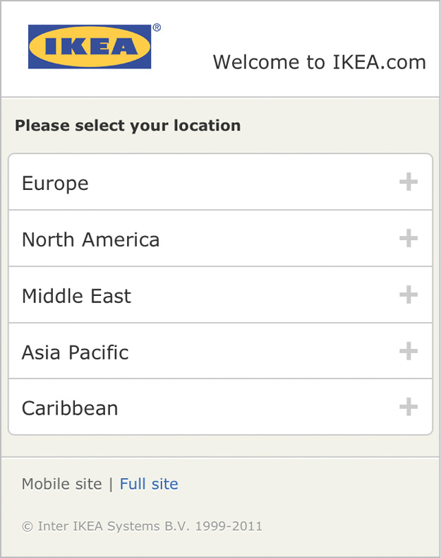
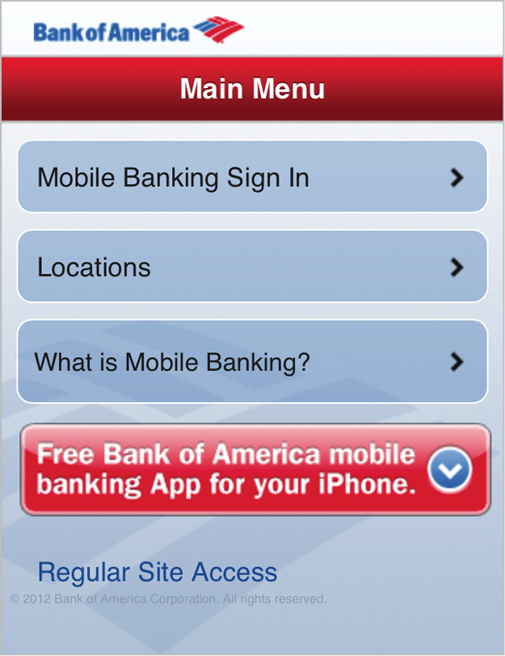
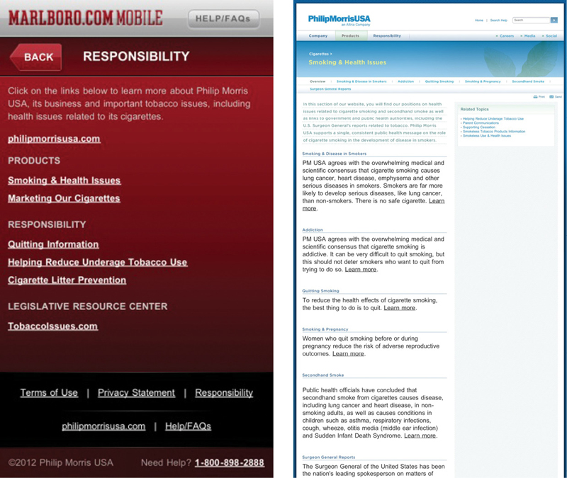
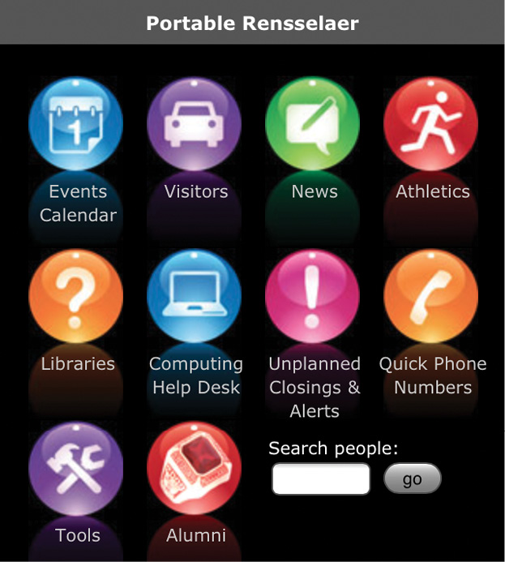
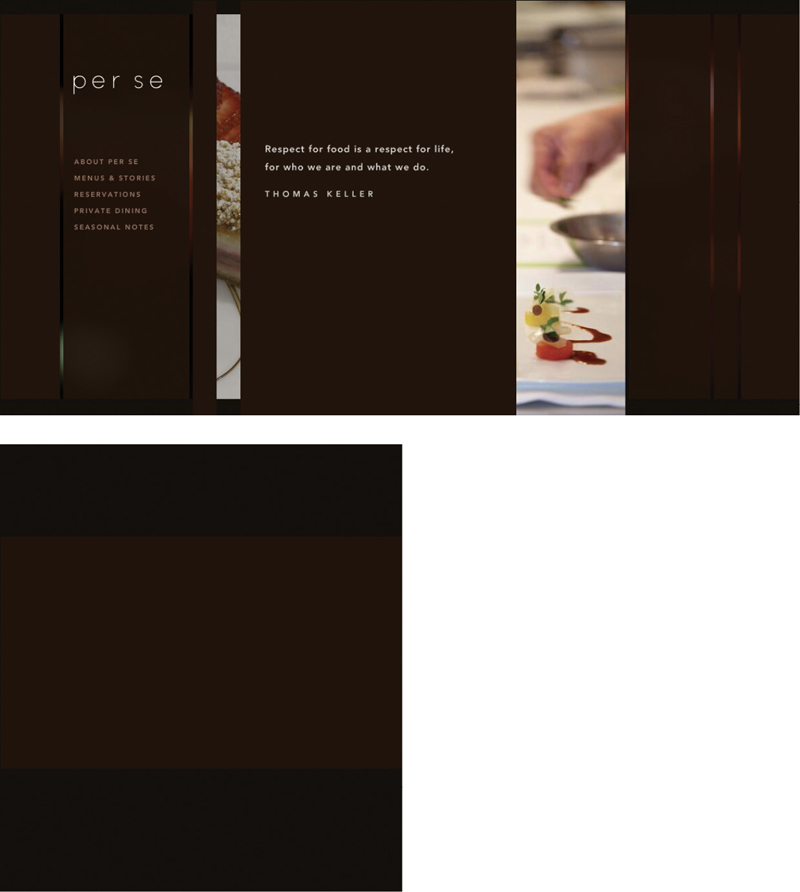
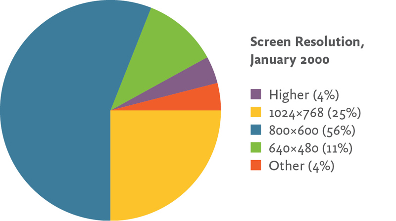
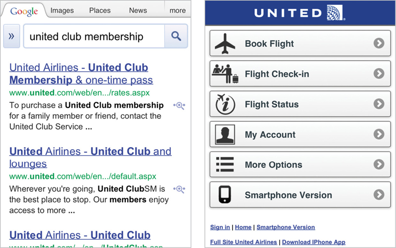
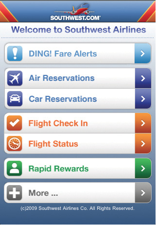
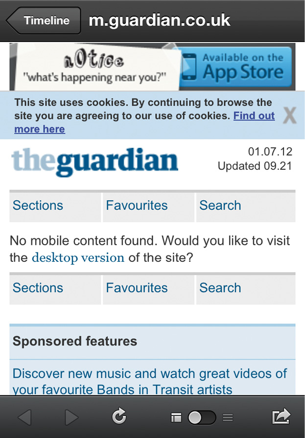

WHEN WE TALK about how to create products and services for mobile, the conversation tends to focus on design and development challenges. How does our design aesthetic change when we’re dealing with a smaller (or higher-resolution) screen? How do we employ (and teach) new gestural interactions that take advantage of touchscreen capabilities? How (and who) will write the code for all these different platforms—and how will we maintain all of them?

Great questions, every one. But focusing just on the design and development questions leaves out one important subject: how are we going to get our content to render appropriately on mobile devices?

The good news is that the answer to this question will help you, regardless of operating system, device capabilities, or screen resolution. If you take the time to figure out the right way to get your content out there, you’ll have the freedom (and the flexibility) to get it everywhere. You can go back to thinking about the right design and development approaches for each platform, because you’ll already have a reusable base of content to work from.

The bad news is that this isn’t a superficial problem. Solving it isn’t something you can do in isolation, by sandboxing off a subset of your content in a stripped-down mobile website or app. The solution requires you to look closely at your content management system, your editorial workflow, even your organizational structure. You may need different tools, different processes, different ways of communicating.

Don’t despair. There’s even *better* news at the end of this rainbow. By taking the time now to examine your content and structure it for maximum flexibility and reuse, you’ll be (better) prepared the next time a new gadget rolls around. You’ll have cleared out all the dead wood, by pruning outdated, badly written, and irrelevant content, which means all your users will have a better experience. You’ll have revised and updated your processes and tools for managing and maintaining content, which means all the content you create in every channel—print, desktop, mobile, TV, social—will be more closely governed.

Sounds great, right? Well, to get there, you first need to admit you have a problem.

## DO WE REALLY NEED TO GET OUR CONTENT ON MOBILE?

Do you have a website? Then you need to get your content onto mobile devices. Period.

### Advertisers

Let’s say your company advertises on television. Or maybe outdoors. Ads are expensive! Maybe you put a URL at the end of the TV spot, maybe you don’t. Maybe you put a QR code on your billboard, maybe you don’t. (Please don’t.) Either way, if you’re not considering what happens when your potential customer picks up her phone after seeing your advertisement, you’re wasting money.

Eighty-six percent of smartphone owners say they use their phone while watching television, and forty-one percent say they do it *every day.* The numbers are even higher for tablet owners ([http://bkaprt.com/csm/1](http://bkaprt.com/csm/1)). Think all those dual-screen users are just tapping away on Facebook? Think again: seventy-one percent of smartphone users say they’ve searched for more information on their mobile device after seeing an advertisement on TV, in print, or online ([http://bkaprt.com/csm/2](http://bkaprt.com/csm/2)).

What do you think will happen after someone sees your TV spot? She’ll remember to look you up tomorrow, when she’s back at her desk? She’ll be satisfied to squint at your desktop website through her tiny little viewport? She’ll really enjoy the error message that says Flash is required to view your website (FIG 1.1)?

Or do you want her to find engaging information about your products and services that will help her decide or make her feel more positive about your brand? A lot of rhetoric about “marketing to the mobile context” can be summed up simply: don’t waste money on advertising if you don’t have a mobile website to back it up.

### Retailers

Retailers need to support three distinct mobile contexts.

First, they need to support customers who use their smartphones to “pre-shop” stores, compare prices, and look up product features and customer reviews before deciding to transact. Sixty-six percent of smartphone owners say they use their phones in just this way to become smarter shoppers ([http://bkaprt.com/csm/3](http://bkaprt.com/csm/3)).

Second, retailers also need to support a truly mobile use case. During the 2011 holiday season, one-third of all American adult cell phone users say they used their mobile phone to look up information while physically in a traditional retail store—either product reviews or pricing information. How many sales are retailers gaining or losing because of information customers find on their phone—potentially information from a competitor? It’s clear that mobile phones influence purchase behavior: when people used their phones to look up pricing information while in-store, thirty-seven percent decided not to buy the product at all and nineteen percent left the store and went online to buy the product ([http://bkaprt.com/csm/4](http://bkaprt.com/csm/4)).

Finally, retailers need to support ecommerce shoppers who choose to transact on their phone instead of on the desktop or in-store. Those shoppers have high expectations: eighty-five percent expect the mobile experience to be equal to or better than the desktop web, and eighty percent expect the experience to be at least as good, if not better, than shopping in the store. Unfortunately, the real world doesn’t live up to their expectations: eighty-four percent of people who have transacted on mobile report experiencing a problem, including error messages, wonky navigation, or insufficient, incorrect, or confusing information ([http://bkaprt.com/csm/5](http://bkaprt.com/csm/5)).

Part of the problem is that only thirty-seven percent of retailers have a website that’s compatible with mobile browsers, and only twenty-six percent of those mobile websites rendered properly in all six major mobile browsers. Apps don’t offer much salvation either—only twenty-six percent of retailers offer any flavor of downloadable app ([http://bkaprt.com/csm/6](http://bkaprt.com/csm/6)).

Shoppers deserve better than the superficial, unhelpful mobile sites even major retailers provide. Mobile sites that don’t provide information, don’t enable transactions, and don’t influence purchase decisions really aren’t very strategic (FIG 1.2).

### Publishers

I have a print subscription to *The New Yorker,* which I read exclusively on airplanes during the twenty minutes around takeoff and landing, when electronic devices are prohibited. Recently, I was flipping through the magazine and came across a long article I looked forward to reading. “I’ve already saved this to Instapaper,” I thought. “I’ll save it until I can read it on my phone later.”

Rich Ziade, CEO of read-it-later app Readability, shared insights from their analytics data in an email that show many people seem to enjoy—not just tolerate—reading on their phones:

> People read on their phones…a lot. A device doesn’t need to be the size of a book for people to want to engage it. In fact, the iPad is proving less than ideal for reading. The screens on our phones have moved beyond the BlackBerry. They’re bigger and sharper and fit in your pocket. We read on our phone. Who knew?

Readability’s data shows that users are even *more* engaged in reading on their mobile devices than on the desktop—and, surprisingly, on the iPad. In March and April 2012, the average time readers spent on the mobilized article view was even longer than the time people spent reading on both the desktop and on tablets.

Publishers, therefore, have one of the most demanding challenges in getting their content onto mobile devices. Users insist on consuming content on the device most convenient for them. A content strategy that limits access to a particular channel or device will simply alienate readers and send them to a competitor. Given the economics of the publishing industry, publishers need a content strategy that supports efficient and cost-effective multi-channel publishing most of all.

### Financial services

More than any other industry, mobile websites for financial services seem to focus on supporting quick tasks for the on-the-go user. Many mobile websites for banks and investment firms offer transactional access only for current customers. And, of course, an ATM finder (FIG 1.3).

But users want more than just transactional capabilities and location-based services. They want information. Fifteen percent of searches for finance and insurance content come from mobile devices ([http://bkaprt.com/csm/7](http://bkaprt.com/csm/7); PDF). They’re not all looking for the closest ATM.

Desktop websites for financial services firms, on the other hand, offer a mix of informational content and task-focused functionality. Visiting the desktop website, users can find product marketing, information about professional services, financial research and data, and tools to help make financial decisions—all of this in addition to the transactional functionality available to customers behind a login.

Even if most users who visit a website for their bank or investment firm go directly to the login, that’s not a reason to ignore all the other reasons that users might visit. Information about the firm’s products and services is just as important—optimizing for the main use case doesn’t mean ignoring everything else.

### Healthcare

Health organizations especially seek to deliver content via mobile devices. Personal, private, and always with us, mobile phones seem perfectly suited to deliver intimate information about our health and well-being.

It should come as no surprise that health information was the top-growing content category on mobile in 2011, with 18.5 million American mobile users accessing health-related content and information, an increase of 134 percent over the previous year ([http://bkaprt.com/csm/8](http://bkaprt.com/csm/8)).

Mobile phones are also a useful healthcare tool because they’re so ubiquitous across age groups, income levels, and ethnic groups. They’re especially powerful at reaching underserved populations, according to Pew Research ([http://bkaprt.com/csm/9](http://bkaprt.com/csm/9)):

> If your organization’s information is not available on a small screen, it’s not available at all to people who rely on their mobile phones for access. That’s likely to be young people, people with lower household incomes, and recent immigrants—arguably important target audiences for public health messages.

Whether you have a public mission aimed at improving health and wellness, or are a private company that needs to communicate with your audience about their medical and healthcare choices, getting content onto mobile devices isn’t something you can ignore. You have a responsibility to make that content available on mobile devices. For example, Marlboro (FIG 1.4) is legally obligated to provide information about the health consequences of cigarettes and smoking cessation resources. But by forcing users to go to the desktop site to find it, they imply those messages just aren’t as important as the marketing information available on their mobile-optimized website.

### Universities

Universities have rightly invested in building mobile websites and apps for their students. Of course they have—you wouldn’t believe how attached young adults are to their phones! (And even if you’re not a university—if you’re trying to reach teens and young adults, you’d better think about how to reach them on their mobile device.)

As of February 2012, sixty-two percent of Americans aged eighteen to twenty-four own a smartphone. When this age group buys a new phone, they’re disproportionately choosing to buy smartphones: eighty percent of those who bought a new phone in the previous three months chose to get a smartphone ([http://bkaprt.com/csm/10](http://bkaprt.com/csm/10)). What’s more, forty-two percent of smartphone owners aged eighteen to twenty-nine say they mostly go online using their phone—they rarely use the desktop web ([http://bkaprt.com/csm/11](http://bkaprt.com/csm/11)).

Universities have invested in building mobile websites and apps aimed at current students. Campus maps, building phone numbers, and parking information are available in a mobile-optimized version at most universities.

Here’s the problem: it’s not just *current* students who might want information about the university on their phones. It’s also prospective students. As of March 2012, thirty-one percent of teens aged fourteen to seventeen have a smartphone. That number is higher for older teens, aged sixteen to seventeen. Teens whose parents have a college education are also slightly more likely than other teens to have a smartphone.

As you might imagine, teenagers use their phones to go online. Over the course of a month, ninety-two percent of teen smartphone owners say they’ve used their phone to go online. Guess what that replaces? Yup, desktop computer use. Teen smartphone owners say they’re less likely to have used a desktop computer than their peers who don’t have a smartphone ([http://bkaprt.com/csm/12](http://bkaprt.com/csm/12)).

While library hours, campus shuttle schedules, and dining hall menus are readily available, admissions and academics information is notably missing (FIG 1.5). What about all the prospective students who will never see the campus tour or application deadlines because they’re glued to their phones?

### Restaurants

> “Mobile users want to see our menu, hours, and delivery number. Desktop users definitely want this 1MB png of someone smiling at a salad.”
> 
> —MAT MARQUIS ([http://bkaprt.com/csm/13](http://bkaprt.com/csm/13))

Restaurant websites are justifiably mocked for being terrible. Flash intros. Menus only available as PDFs. Navigation that dances around the screen, just out of reach. Auto-playing audio files. They’re like a guided tour through web design worst practices. But what’s teeth-gnashingly irritating on the desktop becomes positively impossible on mobile (FIG 1.6).

Farhad Manjoo of *Slate,* in a hard-hitting exposé, tried to uncover the reasons why restaurateurs design websites that are an assault on good taste and seemingly hostile to user intentions. Along the way, he learned that mobile may just be the catalyst hungry diners need to prompt restaurants to design better websites: “I spoke to a few restaurateurs who’ve created great, easy to use, elegant sites, and they all said they were motivated by one thing: they were missing out on traffic from mobile devices,” ([http://bkaprt.com/csm/14](http://bkaprt.com/csm/14)). Small wonder: about thirty percent of searches for restaurants come from mobile, more than for any other industry ([http://bkaprt.com/csm/7](http://bkaprt.com/csm/7)).

## MOBILE IS NOT THE “LITE” VERSION

> “It looks like you're on a train. Would you like me to show you the insultingly simplified mobile site?”
> 
> —CENNYDD BOWLES ([http://bkaprt.com/csm/15](http://bkaprt.com/csm/15))

If people want to do something on the internet, they will want to do it using their mobile device. Period.

The boundaries between “desktop tasks” and “mobile tasks” are fluid, driven as much by the device’s convenience as they are by the ease of the task. Have you ever tried to quickly look up a bit of information from your tablet, simply because you’re too lazy to walk over to your computer? Typed in a lengthy email on your BlackBerry while sitting at your desk, temporarily forgetting your keyboard exists? Discovered that the process to book a ticket from your mobile was *easier* than using the desktop (looking at you, Amtrak!) because all the extra clutter was stripped away?

Have you noticed that the device you choose for a given activity does not necessarily imply your context of use?

People use every device in every location, in every context. They use mobile handsets in restaurants and on the sofa. They use tablets with a focused determination in meetings and in a lazy Sunday morning haze in bed. They use laptops with fat pipes of employer-provided connectivity and with a thin trickle of data siphoned through expensive hotel Wi-Fi. They use desktop workstations on the beach—okay, they really only use traditional desktop machines at desks. You’ve got me on that one.

Knowing the type of device the user is holding doesn’t tell you anything about the user’s intent. Knowing someone’s location doesn’t tell you anything about her goals. You can’t make assumptions about what the user wants to do simply because she has a smaller screen. In fact, all you really know is: she has a smaller screen.

### The immobile context

Users have always accessed our content from a variety of screen sizes and resolutions. Data reported by SecureCube shows that in January 2000, the majority of users visited from a browser with an 800×600 resolution, but a significant minority (twenty-nine percent) accessed the site at 1024×768 or higher, with a smaller percentage (eleven percent) viewing the site at 640×480 ([http://bkaprt.com/csm/16](http://bkaprt.com/csm/16); FIG 1.7). At that time, decisions about how best to present content were seen as design challenges, and developers sought to provide a good reading experience for users at all resolutions, discussing appropriate ways to adjust column widths and screen layouts as content reflowed from smaller to larger screens.

What you didn’t hear designers talking about was the “640×480 context” and how it differed from the “1024×768 context.” No one tried to intuit which tasks would be more important to users browsing at 800×600, so less important options could be hidden from them. No one assumed that people’s mindset, tasks, and goals would be different, simply because they had a different-sized monitor.

Why do we assume that mobile is any different?

## THE MOBILE-ONLY USER

> “Mobile was the final front in the access revolution. It has erased the digital divide. A mobile device is the internet for many people.”
> 
> —SUSANNAH FOX, Pew Research Center ([http://bkaprt.com/csm/9](http://bkaprt.com/csm/9))

The statistics about how mobile computing has changed human behavior often emphasize the developing world. Seventy-five percent of the population of India—approaching a billion people—has a mobile phone ([http://bkaprt.com/csm/17](http://bkaprt.com/csm/17)). China now has more mobile internet users than there are people in the United States ([http://bkaprt.com/csm/18](http://bkaprt.com/csm/18)). Of the ten million people in Egypt who access the mobile web, seventy percent of them are mobile only—they never use the desktop internet ([http://bkaprt.com/csm/19](http://bkaprt.com/csm/19)). For billions of people in the developing world, mobile phones are the only way they will ever connect to the internet.

For many of us, those numbers seem positive and exciting, but remote. We might not be trying to connect with customers outside our own country, and we perhaps aren’t looking to reach people in the developing world. We may never have a need to communicate with our audience using SMS, because everyone we want to reach has access to the web, email, and chat. We assume that a “mobile-only” user is as foreign to us as a villager in Africa, in India, in China.

We’re wrong.

In developed nations, a large and growing minority of users are mobile only. As of June 2012, thirty-one percent of Americans who access the internet from a mobile device say that’s the way they always or mostly go online—they rarely or never use a desktop or laptop computer ([http://bkaprt.com/csm/20](http://bkaprt.com/csm/20)). Those numbers are growing: the Pew Research Center reported in an earlier study from July 2011 that twenty-eight percent of smartphone users go online mostly using their phone ([http://bkaprt.com/csm/11](http://bkaprt.com/csm/11)). While some of those users may also have access to a computer at home or at work, one-third of those “mobile mostly” users have no access to a broadband connection at home ([http://bkaprt.com/csm/21](http://bkaprt.com/csm/21)).

And for those who would argue that mobile mostly users *can* still access your website via desktop, let’s be clear about who gets to make that choice: *they* decide how and when they want to access your content, not you.

As of April 2012, thirty-five percent of Americans currently have no internet access at home. Sixty percent of Americans who make less than $30,000 per year don’t have a broadband connection at home. About half of African American and Hispanic households don’t have broadband access to the internet at home. And eighty-eight percent of Americans without a high school diploma don’t have a broadband internet connection ([http://bkaprt.com/csm/22](http://bkaprt.com/csm/22)).

But as of early 2012, eighty-eight percent of American adults *do* have a mobile phone ([http://bkaprt.com/csm/23](http://bkaprt.com/csm/23)). As of July 2012, 54.9 percent of mobile users own a smartphone—and two-thirds of people who acquired a new phone in the previous three months chose to get a smartphone ([http://bkaprt.com/csm/24](http://bkaprt.com/csm/24)).

As more and more people acquire smartphones, many people who don’t currently have access to the internet will suddenly have it in the palm of their hands. A growing number of people who cannot afford to pay for both mobile phone and broadband internet access pick one device—the phone.

An April 2012 Pew Internet Project report on “Digital Differences” explains how mobile is changing the makeup of who has internet access ([http://bkaprt.com/csm/22](http://bkaprt.com/csm/22)):

> Groups that have traditionally been on the other side of the digital divide in basic internet access are using wireless connections to go online. Among smartphone owners, young adults, minorities, those with no college experience, and those with lower household income levels are more likely than other groups to say that their phone is their main source of internet access.

By 2015, more Americans will access the internet through mobile devices than through desktop computers, according to a prediction by International Data Corporation ([http://bkaprt.com/csm/25](http://bkaprt.com/csm/25)). Some of these people may still have access to the desktop web, but for reasons of context, ease, or laziness, will choose their mobile first. For others, they will have no other way to view your content. For this growing population, if your content doesn’t exist on the mobile screen, it doesn’t exist at all.

### The latest personal computing revolution

Before the personal computer put an IBM clone on every desk, computer usage was available only to mainframe users, who gained access to precious computing time via terminals, restricted to using the computer for only a few brief minutes or hours each week. Though personal computers lacked the processing power of a mainframe, what users gained in flexibility, speed, and the ability to directly interact with the machine made up for the deficiencies in the PC. People adopted this new computing technology and didn’t look back.

For users with no home access to a desktop computer, it’s not hard to imagine them as similar to the mainframe users of the past, signing up by the hour for a sliver of computer access at an internet café, a school computer lab, or a library. And like the PC before it, the smartphone will leapfrog these users past reserved-by-the-hour connectivity and onto an internet where they’re in control. Will the limitations of the smartphone deter them, sending them back to the internet café when they have an important task? Not likely, or only in the most limited of circumstances. For an increasingly large segment of the population, the mobile computer will be their only computer. And like the mainframe users of yore, they won’t mourn the desktop. Instead, they’ll define an entirely new way to interact with the device.

### No heads in the sand

> “There is no reason for any individual to have a computer in his home.”
> 
> —KEN OLSEN, CEO of Digital Equipment Corporation ([http://bkaprt.com/csm/26](http://bkaprt.com/csm/26))

> “There is no reason that anyone will need to do that on mobile.”
> 
> —Your company, probably

Ken Olsen was the cofounder and CEO of Digital Equipment Corporation (DEC), the second-largest computer company in the US during the late 1980s, makers of the very successful PDP and VAX lines of minicomputers. DEC’s downfall (the company was sold to Compaq in 1998) is partially blamed on Olsen’s failure to respond quickly enough to the rising demand for personal computers. DEC struggled in the early 1990s to adapt its business away from its historically profitable line of minicomputers and toward a new line of microcomputers for personal use.

Right now, someone in your company is doing the same thing. Someone in your business is telling himself that mobile is a blip, a grace note, a mere satellite to the larger desktop website. A team of people are all agreeing that offering a full set of content on mobile is a “nice-to-have,” something to think about only after investing in yet another redesign of the “real” website.

They’re wrong.

Delivering content on mobile isn’t an afterthought. It’s a necessity. It isn’t a luxury. It’s a requirement. Do people want to look it up? They’ll want to look it up on mobile. Do people need to search for it? They’ll want to search for it on mobile. Do people want to read it, deeply and fully? They’ll expect to read it on mobile. Do they need to fill it out, document it, and enter it into the system? They’ll need to do it on mobile. Think of any piece of information people may want to access on the internet. They will need to access it on a device that isn’t a desktop website.

This goes double for any organization that needs to reach people outside mainstream desktop users. Are you a government institution? You have a civic responsibility to deliver your content to all your citizens, which means providing it to them on mobile. Are you an equal-opportunity employer? You’re really not—unless you’re delivering your content where African American and Hispanic users can find it. To reach all of these groups, you can’t assume that they’ll take the extra step to go find your desktop website. You need to bring it to where they are. Which is mobile.

## MOBILE TASKS, MOBILE CONTENT

I recently departed Austin, Texas, traveling with three friends. Since we arrived at the airport a bit early, I wanted to lounge in the comfort of the United Club, away from the teeming masses. I felt it would be rude to abandon my friends to a similar fate outside, and so I wanted to know how many guests I could bring with me to the club.

A simple Google search should clear up this problem. Sure enough, I quickly found a link that seemed promising (FIG 1.8).

Alas, following the link to United Club Membership just took me to the homepage for [mobile.united.com](http://mobile.united.com). When users search from a mobile device, United automatically redirects links from Google to its mobile website—without checking to see if the content is available on mobile. If the content doesn’t exist on mobile, the user gets unceremoniously dumped on the homepage of the mobile website. Mobile redirects that break search—how is that ever a good user experience?

Sure, there’s a link to the full desktop site, but that too just dumped me on the desktop homepage. I could try to use United’s internal site search, but I’d wind up pinching and zooming my way through several search result screens formatted for the desktop. And honestly: why should I have to? An answer that should take me one tap from the Google search results should not require searching and tapping through several pages on both the mobile and the desktop sites.

I went and asked the representative at the desk. (Correct answer: two guests.)

I don’t bring this up just because I want to shame United for wantonly redirecting links to a mobile URL when the content isn’t available on its mobile website. (That’s a terrible thing to do, but it comes after a long list of other bad things I’d like to shame United Airlines for doing.) No, I use this example to illustrate a common misconception about mobile devices: that they should deliver only task-based functionality, rather than information-seeking content.

### Information seeking is a task

Luke Wroblewski, in his book *Mobile First,* tells us that Southwest Airlines is doing the right thing by focusing only on travel tasks (FIG 1.9):

> The mobile experience…has a laser-like focus on what customers need and what Southwest does: book travel, check in, check flight status, check miles, and get alerts. No room for anything else. Only what matters most.

Mobile experts and airline app designers don’t get to decide what “actually matters.” What matters is what matters to the user. And that’s just as likely to be finding a piece of information as it is to be completing a task.

Eighty-six percent of smartphone owners have used their phone in the previous month to look up information—whether to solve a problem, settle an argument, get up-to-the minute information such as traffic or sports scores, or to decide whether to visit a business like a restaurant ([http://bkaprt.com/csm/27](http://bkaprt.com/csm/27)). Don’t believe me? Look at your own search history on your mobile device—you’ve probably tried to answer all sorts of questions by looking up information on your phone.

The Southwest Airlines desktop website includes information about their baggage policies, including policies for checked bags, carry-ons, and pets, as well as lost and found, delayed baggage, and a variety of other traveler information, such as what to do if you lose your ticket, need to rebook, or your flight is overbooked. It even includes information for parents looking to book travel for unaccompanied minors, and how Southwest accommodates disabled flyers and the elderly.

The mobile experience does not. Who are we to say that this content doesn’t actually matter?

It’s fine to optimize the mobile experience for the most common tasks. But that doesn’t mean that you should exclude valuable content.

### Mobile is social

Have you ever clicked on a link from Facebook or Twitter on your phone? How about a link someone sent you in an email?

Of course you have. Sharing content with our friends and colleagues is one of the bedrock ways we communicate these days. Users don’t distinguish between accessing email, Facebook, Twitter, or other social services on the desktop or on mobile—they choose them fluidly, depending on which device they’re closest to at the time. In fact, as of June 2012, nearly twenty percent of Facebook members use it exclusively on mobile ([http://bkaprt.com/csm/28](http://bkaprt.com/csm/28)).

If your content isn’t available on mobile—or provides a bad reading experience—you’re missing out on one of the most compelling ways to get people to read it. Is your site littered with icons trying to get people to share your content? If your readers just get an error message when they tap on shared content, all the effort you put into encouraging social sharing is wasted (FIG 1.10).

## DESIGNING FOR CONTEXT

“Context” is the buzzword everyone throws around when talking about mobile. At the South by Southwest Interactive conference in 2011, the panel called “Designing for Context” was the number one must-see session, according to *.net magazine* ([http://bkaprt.com/csm/29](http://bkaprt.com/csm/29)).

The dream is that you can tailor your content for the user’s context—location, time of day, social environment, personal preferences. Based on what you know about the user, you can dynamically personalize the experience so it adapts to meet her needs.

Today, we use “designing for the mobile context” as an excuse to make mobile an inferior experience. Businesses want to invest the least possible time and effort into mobile until they can demonstrate return on investment. Designers believe they can guess what subset of information or functionality users want. Everyone argues that they’re designing for the “mobile use case.”

### Beware of personalized interfaces

Presuming that the “designer knows best” when choosing how to deliver personalized content or functionality is risky. We’re notoriously bad about predicting what someone will want. Even armed with real data, we’re likely to make incorrect assumptions when we decide to show some things and hide others.

Microsoft Office tried this strategy in the late 1990s. Office 97 offered many new features and enhancements, which made the user interface more complex. Long menus and dense toolbars gave the impression that the interface was “bloated” ([http://bkaprt.com/csm/30](http://bkaprt.com/csm/30)). Sound like any desktop websites you know?

In response, Microsoft developed “personalized menus” and “rafted toolbars” which showed the most popular items first (FIG 1.11). Although Microsoft had good data and a powerful algorithm to help determine which items should be presented first, it turned out that users didn’t like being second-guessed. People found it more frustrating to go through a two-stage process, hunting through multiple menus to find what they were looking for. Personalized menus violated one of the core principles of usable design: put the user in control.

Now imagine that instead of clicking a chevron at the bottom of the menu to expand it, the user has to click a link to “full desktop website” and then hunt around in the navigation while squinting at a tiny screen. If your website’s mobile version only offers a subset of your content, you’re giving your users the same frustrating experience. Only much worse.

### You don’t have good data

Microsoft had a ton of data about which options people used most frequently. They developed a complex algorithm to present the default “short” menu based on the items people were most likely to want, based on years of history and research with multiple iterations of their product. And they still made mistakes.

The choices you make about which subset of content you want to deliver probably aren’t backed up by good data. They might not be backed up by any research *at all,* just a gut feeling about which options you imagine will be most important to the mythical on-the-go user.

Even if you do have analytics data about which content people are looking for on mobile, it’s not likely you’re getting an accurate picture of what people *really* want. Today’s crippled mobile experiences are inadequate testing grounds for evaluating what people wish they could do on mobile. As Jason Grigsby, Cofounder of CloudFour.com and MobilePortland.com, says: “We cannot predict future behavior from a current experience that sucks” ([http://bkaprt.com/csm/31](http://bkaprt.com/csm/31)).

### Context is the future!

Designing for context doesn’t necessarily mean delivering less. In the future, it will mean prioritizing information differently, anticipating what the user wants based on known data about the environment or in response to the user’s explicit request.

We’re not there yet. To get there, we need to know a lot more about how people use their mobile devices. Contextual research, usability studies, analytics data, and participatory design are all tools that we can use to determine how best to design for context.

But none of that research will be meaningful if we don’t have a full set of content to work from. If we want objective and accurate data about how people engage with mobile devices, we first need to get *all* of our content on mobile. Only then will we be able to get real facts and glean meaningful insights about what people want, when they want it, and how they want it presented. Until then, we’re just guessing.

If your vision for mobile is designing for context, then the first step you need to take is getting all your content onto mobile devices.

## ALL OF IT? REALLY?

Really. Your content strategy for mobile should not be to develop a satellite to your desktop site, showing only the subset of content you’ve decided a mobile user will need. That’s not going to work because:

* People move fluidly between devices, often choosing a mobile device even when they have access to a desktop computer. Don’t assume you can design for “the on-the-go user” because people use their mobile devices anywhere and everywhere.
* Mobile-only users want and need to look at your content too! Don’t treat them like second-class citizens just because they never or rarely use the desktop. Even if you think of them as “mobile-mostly” users, remember that you don’t get to decide which device they use to access your content. They do.
* Mobile supports reading content just as well as it supports functional tasks. Don’t pat yourself on the back just because you’ve mobile-ized some key features—there’s more work to do with your content.
* Context is a cop out. Don’t use context as a rationale to withhold content unless you have real research and data about what users need in a given situation or environment. Unless you have that, you’re going to guess wrong. (And even if you do have that—given the crappy experiences most users get on mobile today, you’ll still probably guess wrong.)

You should aim for content parity between your desktop and your mobile experiences—maybe not exactly the same content presented exactly the same way, but essentially the same experience. Never force users to go to the desktop website for content they’re seeking on a mobile device.

Freaking out? Convinced it’s impossible to achieve content parity across all your devices? There is a way.
