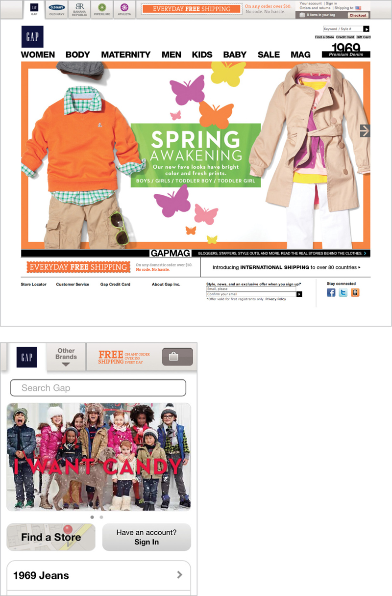
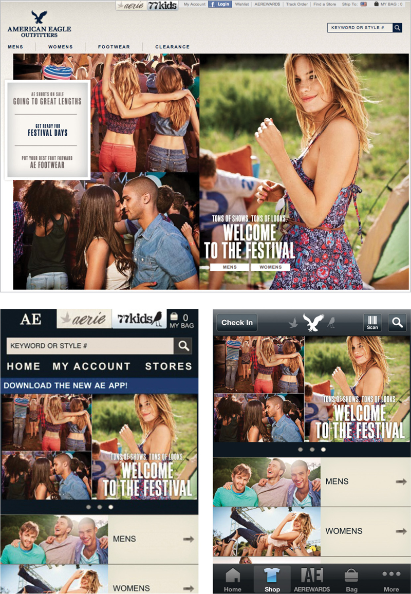

ANY CONVERSATION about mobile seems to focus on these debates:

* Should we design a mobile website or a native app?
* Should we build separate apps for iOS and Android? What about building apps on other platforms, like Windows?
* Should we plan a responsively designed website that will adapt across desktop, tablet, and phones?
* Should we create a separate mobile website, with its own set of custom-designed templates?

From a design and development perspective, the answer to these questions is: *it depends.* There are good arguments in favor of each of these options. Speed, gestures, polish, discoverability, search, sharing, accessibility—all these and more come into play. There are plenty of pundits out there willing to argue with you late into the night about which approach is best.

But there’s no point in debating the merits of the container if you don’t know what you want to put in it. Or if you don’t have a funnel.

The real problem for most companies isn’t which format they choose to get their content on mobile. It’s getting their content on mobile at all.

The answer to these questions—at least as far as your content is concerned—is: *yes.* Chances are, you will need to get your content onto the mobile web (responsive or no) and into native apps designed for iPhones, iPads, Android phones and tablets, Windows, and BlackBerry.

Like with the web before it, we’ve focused on talking about design and development before figuring out the content. We’re so caught up in the excitement around gestures and geolocation, HTML5, and responsive design, that we’ve lost sight of mobile’s real challenge. Which, like the web before it, is *content strategy:* figuring out how we’re going to create, manage, and maintain our content across all these platforms and devices.

Our first-order problem is to develop processes and infrastructure to get your content into a format that your user can view on whichever platform they choose. What will your workflow be for managing content across platforms? Can you live up to the demands of regular multi-channel publishing, keeping everything in sync? Whether you want a mobile website, a native app, or both, designing and developing for that platform will be easier if you have a content strategy in place.

## A SEPARATE MOBILE WEBSITE

Recently, usability pioneer Jakob Nielsen argued that you should “Build a separate mobile-optimized site (or mobile site) if you can afford it,” where you cut features and content “that are not core to the mobile use case,” ([http://bkaprt.com/csm/32](http://bkaprt.com/csm/32)).

Mobile designers and developers responded swiftly to argue that creating a separate mobile website is a bad idea ([http://bkaprt.com/csm/33](http://bkaprt.com/csm/33)). According to Josh Clark, author of *Tapworthy: Designing Great iPhone Apps,* suggesting that a separate mobile website is an appropriate strategy perpetuates “several stubborn mobile myths that have led too many to create ‘lite’ mobile experiences that patronize users, undermine business goals, and soak up design and tech resources” ([http://bkaprt.com/csm/34](http://bkaprt.com/csm/34)).

Noz Urbina, Senior Consultant and Business Development Manager for Mekon Ltd., told me that the idea of a separate mobile website rests on a false expectation about how you will manage and maintain your content:

> The solution being a mobile site implies two falsehoods: that “mobile” is just one platform and needs only one site to solve it, and that maintaining separate sites per platform is going to be a sustainable strategy. Your content is a constantly evolving body of assets that must be maintained, and the same users will be accessing your content in various ways. Sites like Facebook, eBay, Amazon, Evernote, and myriad more are setting a market expectation that no matter the mode of interaction, content should be consistent, relevant, and up-to-date—regardless of how it’s accessed.

From a content strategy perspective, the risk of developing a separate mobile website is that you’ll wind up maintaining duplicate content in multiple places. News flash: this will be a disaster. Separate processes. Out-of-sync updates. Wasted effort.

The reason a separate mobile website is dangerous is that, in general, you want to avoid creating multiple versions of your website. It’s called forking, and it’s a forking nightmare from a maintenance perspective. If you fork your website into separate mobile and desktop versions, then you’re stuck updating both every time there’s a change. Avoiding this problem is tricky, even with sophisticated content management systems. But before we get there, let’s start with a simple scenario.

### Manage content like it’s 1999

Imagine you have a static website that you created back in the late 90s. There’s no CMS, so all the content is hard-coded into your HTML. (If you can’t imagine any organization still living in these dark ages, take note that fifty-seven percent of domains under development by American federal agencies are not being built with a CMS: [http://bkaprt.com/csm/35](http://bkaprt.com/csm/35); PDF.)

You decide that you want to join the twenty-first century by creating a mobile website. Good for you! Except for the nightmare part, which is that you’ll essentially create a totally separate website, and now you must update both versions every time there’s a change. You must code two completely different sets of pages: unique templates for both desktop and mobile. And even if—especially if—you want to publish exactly the same content to both places, you must maintain two separate versions of the content too. Double your workload, double your fun?

### Cut features! Cut content!

*Great!* You might think creating distinct content is actually an advantage. A separate mobile website will still be aces if you don’t want to publish exactly the same information. Cut features, cut content, and re-prioritize your messages. You’ll publish a mobile website that only shows a subset of content, targeted specifically at the mobile user’s needs.

Let’s set aside for a moment the argument about whether or not that’s the right user experience. (It’s not.)

From a maintenance perspective, you’re still forking your content. Want to add a new page? Edit a description? Fix a typo? You’ll be doing it twice.

### But that’s why I have a CMS

The whole point of having a content management system is to help streamline the publishing workflow, right? So of course, you just assume that your current CMS will make it easy to publish content to different channels and platforms.

Jakob Nielsen makes this assumption when asked about the dangers of forking your content ([http://bkaprt.com/csm/36](http://bkaprt.com/csm/36)):

> I would assume that most industrial-scale sites would be generated from a single back-end product database and content management system, with the different designs represented by templates and rules about what information goes into what version.

Unfortunately, today, many CMSs don’t easily support this type of multi-channel publishing without considerable investment in custom development. Ask your CMS to display similar-but-not-the-same content in different templates according to a set of business rules, and it’ll start spewing out yards of dot-matrix printer paper, beeping that it “does not compute.” True multi-channel publishing isn’t built into low-cost or even mid-range CMSs—usually only larger enterprise CMSs designed to support publishing to both print and web can handle it.

### You have a Web CMS

Many CMSs are designed to publish to one and only one platform: the desktop web. In a Web CMS, content authoring and management functions are “coupled” with content publishing and display functions. (If you have a large-scale enterprise CMS, it’s likely “decoupled” and this point may not apply to you.)

Most websites simply don't have a content management backend that will support populating different design templates with different content. Content assets (like text fields, images, and supporting media) are usually locked to a specific output format or design. That wasn’t a problem until now, because no one expected the CMS to have to support publishing to different channels—the desktop web was all there was.

The fact that the CMS works this way is no mere implementation detail. Unfortunately, it’s fundamental to the way content is published on the web today. We’ve got to fix this if we’re going to deliver optimized experiences on desktop and mobile.

### Multi-theme management

Now, some CMSs do, in fact, support publishing content to multiple templates. Publishing the same content to different “themes” allows a WordPress blog or a Drupal site to have separate templates for desktop and mobile content display. Note that says “separate templates”—not separate content. These CMSs still like to publish the same content on both sites. (Specifically, they’re happy when publishing the same blob of “body” or “node” content one-to-one across desktop and mobile. Other content elements, like sidebars or user comments, are often stored in a different location and may be stripped out.)

What these CMSs don’t do (at least not without putting significant effort into it) is support publishing different content to different templates according to a set of business rules. So if you plan to deliver less content to your mobile user, chances are your CMS isn’t going to make that easy on you. You’re still going to have to maintain two versions of that content, and update them separately whenever there’s a change.

In other words, you’re forked.

### Responsive design to the rescue?

Responsive design is often held up as a solution that saves you from having to maintain multiple separate codebases for your front-end code. Put the effort in to developing one set of code that will adapt to different screen sizes and progressively enhance for different device capabilities, and you’ll save time in the long run. You’ll also get out of the arms race of having to support dozens of different devices and form factors.

Responsive design is also an approach that saves you from forking your content. If you have a coupled CMS that can only handle publishing to one set of templates, then you can trick your CMS into publishing to different devices by handling the conversion to mobile or tablet sizes on the front-end.

But responsive design is just one tactic that may help solve this problem. The decision on whether to develop a responsive site or to maintain different templates for desktop, phone, and everything in-between is a pragmatic choice based on how you want to allocate time and resources for development and maintenance. There are good reasons for both approaches—often rooted in the specifics of how your CMS functions—and what works for one organization may not work for another.

Whether you choose to employ a responsive design or opt to develop separate templates for different screen sizes, there is still an underlying issue that needs to be solved. Let’s not lose sight of the fundamental issue, which is how to evolve our content management tools and processes to effectively support multi-channel publishing.

## DON’T GET FORKED IN THE APP

The CEO of BigCo got an iPad on the day it came out. (He’s got friends in Cupertino.) He loves his new toy. He loves it so much, in fact, that he wants to give iPads to his entire salesforce. He imagines the tablet will be a great sales tool—more intimate than a presentation given in a dark conference room by the light of the projector and less awkward than having prospective clients huddle around a laptop. Also? Way cooler.

He gives his team a mandate: he wants the salesforce outfitted with iPads that they’ll use to demo products by the end of the year. He’s not alone in this ambition. Seventy-eight percent of enterprises surveyed by Model Metrics say they plan to deploy tablets by the end of 2013, and forty-seven percent of them say they want to use tablets as tools for their salesforce ([http://bkaprt.com/csm/37](http://bkaprt.com/csm/37); PDF).

The digital team started brainstorming how their native iPad app should look and work. Excited about the possibilities, they imagined interactive graphics showing schematic product diagrams, video demos, even product spec sheets that can be customized on the fly. And, of course, all the slick motion transitions and gestural behaviors that come along with a native iOS app.

Exciting, right? “Hold on there, guys,” the lone content strategist said, “I have a few questions.” Questions like:

* Are we going to repurpose the product information from the desktop website for this app, or do we need to create all new content?
* What about the videos and interactive graphics? Those don’t exist today—are we going to create all of them? Creating new videos and graphics will be expensive, so shouldn’t we have a plan to put them up on the desktop website too?
* Is all this content going to live in our current CMS? What will be the process to publish content from the CMS to the iPad app? If we’re creating different content for the desktop website and the iPad, will the CMS make it possible to manage that content as one integrated package?
* What if the CMS won’t play nicely with the iPad app? Will we need to migrate a chunk of the content to live in the app?
* If we’re maintaining two completely separate versions of our product content, what will happen when we update the product information, or when we launch a new product? How will we keep the website and the iPad app in sync?
* Are you going to double my salary now that I’m doing twice the work?

These examples aren’t mere hypotheticals. Great ideas for mobile experiences—carried out by successful companies with the resources and budget to develop them—can fail if they haven’t figured out the workflow needed to support and maintain them.

## DON’T DOUBLE YOUR WORKLOAD

Imagine you visited the Gap’s website on your laptop computer one day this spring. You might have been enticed to buy a spring raincoat, or maybe even try this season’s hottest trend, neon denim trousers. (Or maybe not.) Had you visited the mobile website on the very same day, you would have felt a chill in the air from all the winter clothes on that homepage (FIG 2.1).

Looking at the disparity between these two sites, you might wonder if Colin, the junior marketing guy in charge of updating the mobile website, got fired over this boneheaded mistake. Looking at this problem across an entire industry, however, you realize the solution isn’t blaming the low man on the totem pole.

The Gap’s problem isn’t Colin. The Gap’s problem is that they have two completely separate processes for maintaining each homepage—maybe even two distinct systems, operated by two different people. Instead of updating the new homepage graphic in *one* place and having it automatically publish to everywhere it needs to go, they forked their content.

Even though they have processes that encourage this kind of inconsistency, the Gap still wants to communicate the same messages to the same customers. (It’s not like they realized that all their mobile users live in the frozen tundra, right?)

American Eagle pulls this off by not forking their content. They maintain one set of content—they use the same homepage image everywhere, even though it might be cropped and laid out differently for different screen sizes (FIG 2.2). This means they can communicate one consistent message across the desktop, mobile web, and mobile app. Their process and workflow is simplified, because they only have to update the content in one place. (Or maybe their version of Colin is just way more on the ball.)

### More work in your workflow

Since 2010, magazine publisher Condé Nast has invested heavily in building custom iPad editions for some of its most popular titles, including *Glamour, GQ, Wired,* and *Vanity Fair.* Existing art and production staffers have doubled—no, tripled—their workload, first laying out the print edition, then repurposing its design and content for two different iPad layouts: portrait and landscape ([http://bkaprt.com/csm/38](http://bkaprt.com/csm/38)).

These iPad editions are not so much a digital magazine as a giant PDF of the print edition. As such they lack many of the benefits you might expect from a truly digital property:

#### They’re heavy

Digital magazines regularly weigh in at 150 MB or more, taking twenty minutes to download on a broadband connection. You could drive to the store and buy the print magazine in less time ([http://bkaprt.com/csm/39](http://bkaprt.com/csm/39)).

#### They’re unsociable

Want to send one of your friends a link to an article? Copy and paste some of the text to quote on your blog? Heck, do you want to search the text? These basic digital functions are made cumbersome—or impossible—by the fact that what you’re looking at is a giant picture of the print magazine.

#### They’re gimmicky

The print editorial teams behind most iPad editions don’t want to seem like they’ve missed the interactive revolution. The content gets dressed up with unnecessary animations and glitzy transitions that don’t necessarily add value for the iPad reader. This problem is magnified because the effort that goes into creating these effects doesn’t benefit anyone else—they’re tablet only.

#### They’re not earning their keep

We could overlook this if digital magazines were delivering real value to readers and the business. They’re not. Let’s take Condé Nast’s *Glamour* magazine as an example. *Glamour* is known in the industry for being Condé’s most lucrative title. In the U.S. they sell more than two million annual print subscriptions. [glamour.com](http://glamour.com) has an online monthly readership of about 1.2 million unique visitors. Yet in November 2010, they sold 2,775 copies of the iPad edition. Can you imagine being the beleaguered *Glamour* magazine staffer who has to stay up nights and work weekends after the print magazine has gone to bed, laying out *two* different versions of an iPad edition that sells fewer than 3,000 copies?

The core problem here isn’t that sales are weak, or that iPad editions don’t live up to what we expect in digital. The problem is that Condé Nast has created much more work for themselves, and they aren’t seeing a return on that investment. Scott Dadich, Condé Nast’s Content Innovation VP—and the architect of their iPad strategy—acknowledged that the problem is their workflow: “Bringing it all together into a cohesive workflow has been a real challenge for us. It’s been tough—there’s a lot more work” ([http://bkaprt.com/csm/40](http://bkaprt.com/csm/40)).

## NO FORKING WAY

The acrimony and the debates around mobile web *vs.* native apps, or responsive design *vs.* separate templates are missing the point. The challenge for most organizations in the long run won’t be figuring out a development approach for cross-platform code—because these techniques will evolve and standardize.

The challenge will be supporting a multi-channel editorial workflow, particularly if they want to prioritize content differently across platforms.

Any arguments about whether to deliver less content or different content to the mobile users need to consider the effort required to manage and maintain that content. If you’re going around suggesting that you want to provide a different experience for mobile users, or you want to cut content from the mobile website, be aware that this approach may doom you to content maintenance and governance headaches. Paying attention to this is the very essence of content strategy.

The root of the problem is in our internal processes, workflow, and tools. To avoid the problem of content forking we need a new approach to publishing content to multiple devices. We need adaptive content.

## THE FUTURE IS ADAPTIVE CONTENT

Let’s say we all agree on a glorious future, in which desktop and mobile users all get access to complete (or at least, equivalent) content, appropriately structured, designed, and formatted for their device. Whether we want to deliver exactly the same content to everyone, or prioritize and feature content differently on different platforms, we have a process that helps us do that without wasted effort.

That future is *adaptive content.* Adaptive content is content that is flexible, so it can adapt to different screen sizes, and can be presented in different formats as appropriate for the device. What’s the secret to this flexibility? Why, it’s having more structure! Adaptive content has structure and metadata attached to it, which helps it figure out what to do when it winds up on all those different platforms and devices.

Adaptive content is composed of these five elements:

* Content that gets created with the goal of making it reusable, rather than by someone who imagines that it will “live” on a particular platform.
* Structured content that can be combined in different ways for different platforms.
* Presentation-independent content that hasn’t been styled and formatted for a single display.
* Metadata that will allow platforms to “query” the content and display the content elements best suited to a particular display.
* A CMS user interface that encourages writers to create content elements and variations within a package, instead of tying content to specific pages.

Understanding adaptive content is super important to developing your content strategy for mobile. Let’s dig into this topic in more detail in the next chapter.
