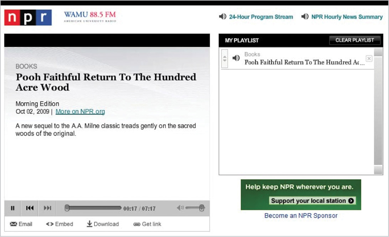
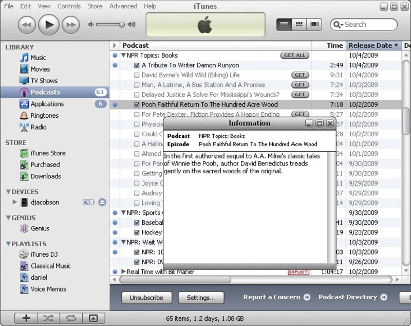
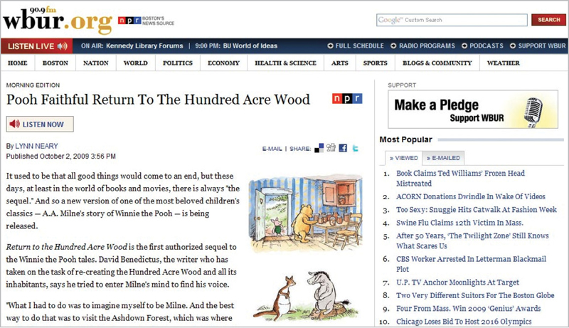
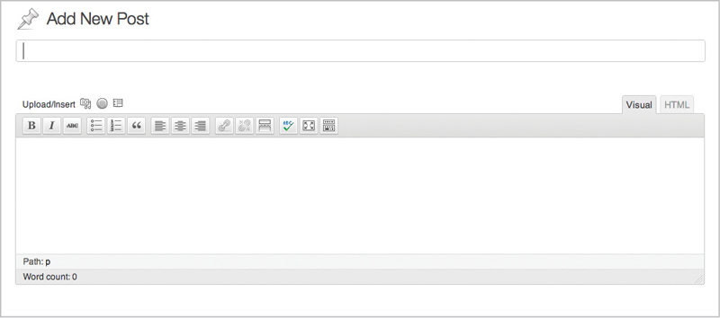
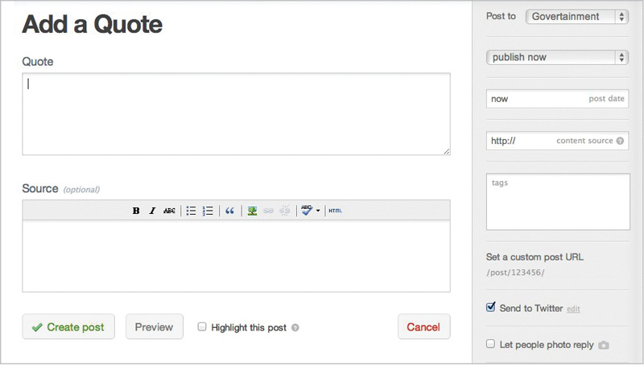
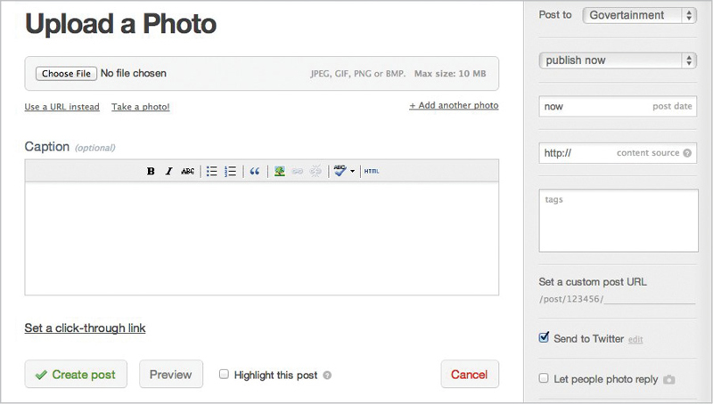
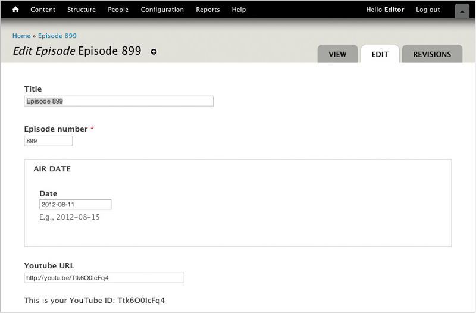
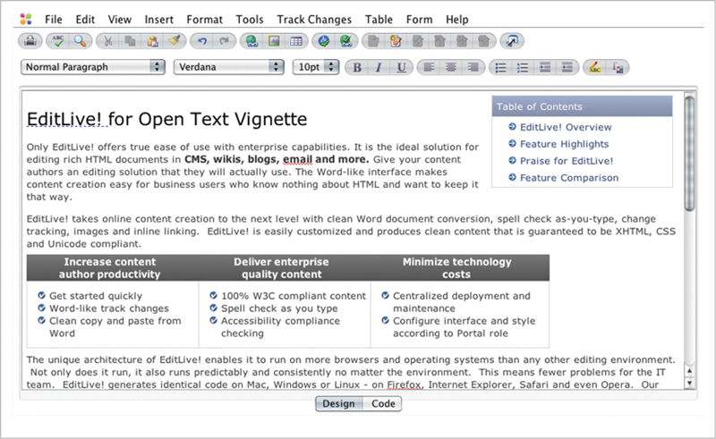
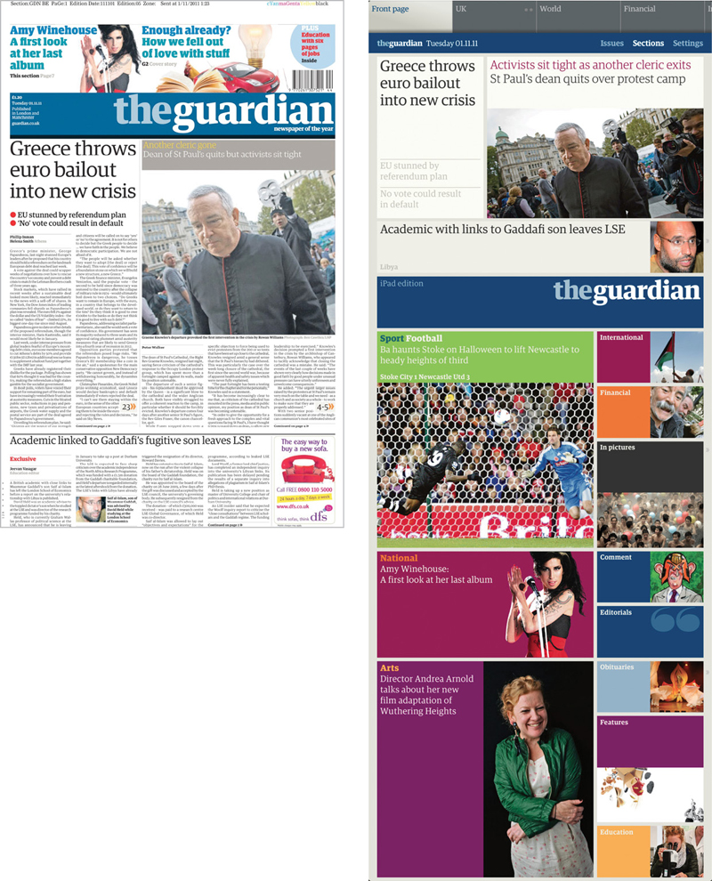
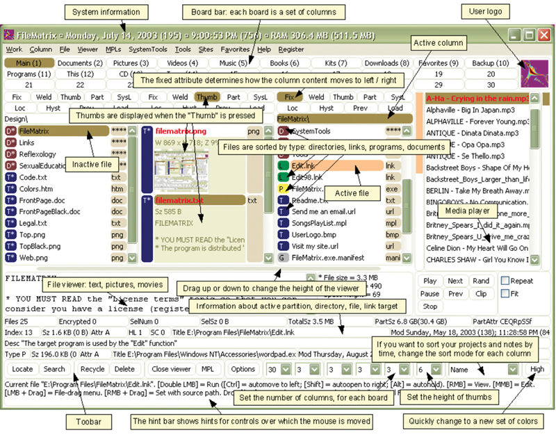

> “Get your content ready to go anywhere because it’s going to go everywhere.”
> 
> —BRAD FROST ([http://bkaprt.com/csm/41](http://bkaprt.com/csm/41))

Adaptive content is more than just “mobile.” It means getting your content into a format so you can share and distribute it to any platform you want. It means you can get your content onto platforms you control—and platforms you don’t. It even means you’ll have a fighting shot at getting your content onto platforms that haven’t been invented yet.

Rich Ziade, CEO of Readability, told me that he thinks this problem is even bigger than mobile:

> The mobile browser is no longer the sole destination of the hyperlink. Stuff opens inside of Twitter, Facebook, etc., and that means that content needs to be ready to go in all these new contexts. Content is being plucked and refitted everywhere. Take a look at most modern Twitter clients: they show Instagram photos and links to videos inline in the Tweet. That’s not a webpage anymore. It’s just the content in whatever context makes sense. This is one step beyond responsive design and form factors of devices. It is content reduced down to its essence then custom-tailored.

The magic trick we’re trying to perform is to get our content ready to go anywhere. Smartphones might be the most pressing multi-platform problem right now, but they’re not going to be the last one. Can you imagine your content showing up on someone’s heads-up display, like Google Goggles? Being read aloud during someone’s commute to work? Appearing (and being readable) across the room, on someone’s giant-screen TV set?

Noz Urbina from Mekon, Ltd. told me he wonders whether our content is ready to go into the kitchen:

> What happens when your cooktop functions like a giant iPad? Manufacturers are already making noise on the internet about data-enabling various household devices, and how resistant they will be to extremes of temperature and shock. Will your content be ready to go there? It’s a great content consumption context.

What would it look like if you thought of your content as a service that could be accessed by a variety of different platforms, rather than as a substance that lives in a particular location?

## CONTENT AS A SERVICE

NPR, America’s National Public Radio, has spent several years making their content accessible through an approach they call COPE, which stands for Create Once, Publish Everywhere. As a result, they have a clean base of well-structured content that they can display on many platforms.

A book review that includes a headline, teaser content, body copy, audio, multiple images, topic categorization, and book metadata can be displayed on a wide variety of platforms. Each platform can choose which content objects it wants to display, and how to format them (FIG 3.1–3.5).

.").")

These examples from NPR illustrate two key aspects of adaptive content: multiple content structures and tailored visual presentation.

### Multiple content structures

NPR writes a summary for each piece, which means that their story gets an appropriate introduction, wherever it might appear. While other publications might think they could just rely on the first sentence or two of the article to serve as a teaser, NPR takes the time to write a custom summary. They don’t just write one teaser, either: they write two! A short version and a long version gives them extra flexibility, allowing each platform to decide how much space to devote to the summary.

Another interesting way that NPR uses multiple content structures is that they treat the body copy for the story and the audio file like they’re equal—neither is considered primary. Whether the platform is more text-focused (like a website) or more audio-focused (like a player) each content package can be displayed for maximum effect. Each platform can choose the right mix of content objects—teasers, audio, and images can be combined in different ways based on what each platform needs and does well.

While NPR only creates one headline for each story, it’s possible that they could write more. If you’re thinking about creating multiple content structures, writing multiple headlines also offers more flexibility. You could write shorter and longer versions, some optimized for SEO, some for human consumption. (We’ll cover how to do this in the chapter on information architecture.)

### Unique visual presentation

If you care about providing great design and a user experience that’s appropriate for a given platform, you need to be thinking about adaptive content.

NPR has the ability to make the same story look and function differently on each platform. The order, density, and priority of content is different. The typography is different. The use of images is different. The audio player is different. Even though each platform draws from the exact same content package, they all look and feel like their own unique experience. They can tailor the design to create the best experience for that platform.

This is possible because NPR focuses on creating structured content independent of visual presentation. They permit and enable each delivery platform to make its own decisions about how to style the content, because formatting isn’t embedded in the content. They also create content for maximum flexibility, creating multiple sizes and versions for text, images, and audio formats. And, they make it possible for each platform to query the content to determine which content chunks to display.

As a result, each platform can deliver a great user experience, tailored for the capabilities of each device.

### How do they do it?

How does this magic happen? And is it something you can do in your organization, even if you’re not a major publisher like NPR? You can, if you start thinking about creating adaptive content.

Getting there means you need to create content that embodies the five key elements of adaptive content:

* **Reusable content:** content has been developed to maximize reuse across platforms; where that’s impossible, different formats or types of content are available.
* **Structured content:** discrete content chunks can be combined in different ways for different platforms.
* **Presentation-independent content:** design decisions can be made by the platform, rather than having style and format imposed on the content.
* **Meaningful metadata:** category, tag, author, and date information can be used to filter or highlight content, and metadata can be used to help platforms decide which content to display.
* **Usable CMS interfaces:** content management UI and workflow encourages people to create well-structured and metadata-enhanced content, without letting them fall back on making styling choices.

Let’s look at each of these in turn.

## REUSABLE CONTENT

If you’re thinking of a specific context when you create content, your mind naturally wraps itself into the opportunities and constraints inherent in that medium. Imagining that your content can and will be reused in many ways poses its own set of limitations and benefits.

While many things need to change before organizations can start creating reusable content, the most fundamental challenge is a change in mindset. Content creators need to break free of imagining a single context where their content is going to “live” and instead plan for content reuse.

### Written for reuse

Content written for one context often doesn’t make the leap to other places all that well. To give your content the best shot at making sense in whatever way the user wants or needs to consume it, you should do the following:

#### Write standalone headlines

Because you can use page titles in multiple places, write standalone headlines so that they can serve as page headers and links. If you’re only going to write one page title, then ensure that headline includes keywords to help the user decide whether she wants to click on the link, and determine if she’s in the right place.

The following headlines are used for both the article title and the link title on landing pages and in search engines. They offer keywords and an enticement to click ([http://bkaprt.com/csm/43](http://bkaprt.com/csm/43)):

* 15 Case Studies to Get Your Client on Board With Social Media (*Mashable,* [http://bkaprt.com/csm/44](http://bkaprt.com/csm/44))
* Scott Forstall, the Sorcerer’s Apprentice at Apple (*Bloomberg Businessweek,* [http://bkaprt.com/csm/45](http://bkaprt.com/csm/45))
* What Everyone Is Too Polite to Say About Steve Jobs (*Gawker,* [http://bkaprt.com/csm/46](http://bkaprt.com/csm/46))

#### Write multiple headlines

Sometimes, it’s just not possible to write a single headline that works in every context. You may have to write multiple headline versions—some that work as page titles, some that work as links. (More about how to do this is coming up, in the chapter on information architecture.)

The following headlines offer a good balance—headlines that work as entertaining page titles aren’t expected to do double-duty as links ([http://bkaprt.com/csm/43](http://bkaprt.com/csm/43)). This approach provides extra value when combined in a one-two punch—they could be combined into a longer headline or the link title could be used as a summary:

* Article Title: “What’s Eating the NYPD?”; link: Why the NYPD Is Turning on Ray Kelly (*New York Magazine,* [http://bkaprt.com/csm/47](http://bkaprt.com/csm/47))
* Article Title: “Citizen Cain”; link: Herman Cain’s Unlikely Republican Rise (*Newsweek,* [http://bkaprt.com/csm/48](http://bkaprt.com/csm/48))
* Article Title: “When Is a Flip Not a Flop?”; link: The Fate of the Republicans Who Supported Gay Marriage (*The New York Times Magazine,* [http://bkaprt.com/csm/49](http://bkaprt.com/csm/49))

#### Don’t bury the lede

When you write for the web, put the most important information up front. If you don’t grab your reader right from the start, they’re likely to wander off in search of something more interesting.

This adage is even more true when you’re writing content that may be reused in other contexts. If the first sentence/paragraph contain meaty, useful information, you protect yourself if they ever need to be used as a navigation summary or if the rest of the text gets truncated. If the first sentence says nothing of interest, why would your reader want to tap for more information?

Similarly, you should focus on just one main idea in each chunk of text (whether that’s a paragraph or a section). Readers are likely to scan headings and initial sentences, searching for words that they think will answer their questions. If you combine multiple ideas in a chunk with no visual separation or distinction between them, important information will likely be overlooked.

### Alternative content

One of the most frustrating parts of looking at content on mobile devices is discovering that useful or necessary content isn’t accessible because the content format didn’t translate well to a different screen size or platform capability. Whether it’s a video that’s only available in Flash, or an infographic that doesn’t scale for a smaller screen, some content just won’t work in other contexts.

Creating reusable content means recognizing when content *can’t* be reused, and developing an alternative. Remember how NPR could publish the same story to a website and an audio player? Having both text and audio gives them more options. You might need to consider alternatives for the following:

#### Images

Scaling images and infographics across a tiny mobile phone and a giant Retina display just won’t work. You will need additional image sizes cropped. If the image can’t be cropped or scaled without losing its meaning, then you will need an alternative: find another image or describe the image’s content in the body text or alt text.

#### Data visualizations

Interactive data visualizations can be engaging both on the desktop and on touchscreens, provided they’re built for reuse across platforms. In situations where the screen size or device capabilities won’t support their display, have a fallback mechanism, like displaying a simple table of the data.

#### Audio and video

Alternative formats (taking advantage of HTML5’s support for multiple video formats) will help ensure that everyone can access these forms of media. Beyond that, providing a transcript or text summary for any audio or video content will make it more flexible for reuse (as well as more accessible to people with disabilities and friendly to search engines).

### Managed reuse

Have you ever searched around in your email, Word documents, or website, looking for a snippet of content you’d previously created and wanted to reuse? Across a variety of different forms of professional communication—cover letters, business proposals, legal documents—it doesn’t make sense to keep creating and recreating the wheel.

Most people handle this process opportunistically: they hunt around for the paragraph or graphic they want to repurpose, then copy and paste it into place. Others might handle it in a more organized fashion, maintaining a library of boilerplate documents that they can efficiently browse or search.

But what most people don’t have is a system that manages content for planned reuse. Because you’re copying and pasting each content element uniquely, you’re creating different instances of the content. If you want to make a change to that content object, you’ll have to change it everywhere you used it.

That might work for your individual publishing workflow, but it’s not going to fly when you’re planning for large-scale, multi-channel publishing. Effective content reuse across platforms means you need a way to update content in one place and have the changes reflected everywhere.

To support that, you’ll need the next aspect of adaptive content, which is **structured content.**

## STRUCTURED CONTENT

> “The more structure you put into content the freer it will become.”
> 
> —RACHEL LOVINGER, Content Strategy Director, Razorfish ([http://bkaprt.com/csm/50](http://bkaprt.com/csm/50); PDF)

The foundation of adaptive content is structured content: to make content flexible for reuse, you must structure it into meaningful chunks.

Structured content is fundamental to how we think about publishing on the internet. Instead of being fixed on paper, content is stored in a database. The structure we put into that database gives content more meaning, which means we can do more with it. If we break long stretches of content down into smaller chunks, we’re then free to combine and recombine them in new ways. If we categorize our content consistently—either by entering it into fields or marking it up with tags—then we can sort, filter, and prioritize it.

None of this happens by magic. It takes human effort (and/or really smart robots) to add the right structure to content. And because it takes effort, it’s easy to backslide.

### Chunks, not blobs

Many organizations insist their editing workflow requires a giant blob into which they can dump whatever they want—text, headings, images, tables, audio, videos—anything and everything that can show up on a webpage. If your organization is using a blogging platform like WordPress as its CMS, you know what this looks like. Content creators get one big field for the body of their content, and it’s like their own personal playground (FIG 3.6).

What happens to that giant blob of stuff (that’s the technical term) when it’s time to put it on another platform? Your content can’t be broken up into smaller pieces for display and reading on different screens. Your content can’t be targeted differently to different platforms—forget about an NPR-style COPE model, or even alternatives for unsupported content types. Your content blob will gloppily resist any attempt to make it firm up.

If you want your content to be reusable, flexible, and adaptable to change, it needs structure.

Tumblr takes a totally different approach to a content editing workflow, guiding users to create appropriate chunks of content, rather than just giving them one big blob. Tumblr defines a set of content types: photos, quotes, chat transcripts, audio, video, and links, in addition to the generic text blob.

Different interfaces for each of these content types help guide users to structure their content. Because Tumblr took the time to figure out which fields and metadata would be required to support each content type, they can help users enter their information more easily. Done well, structured content makes for a better editing experience for content authors (FIG 3.7–3.8).

The war of blobs vs. chunks comes down to having strong content structure. But how do you achieve that? In the same way that Tumblr defined a set of content types (photo, quote, audio) and defined the fields that would make up those types, you need to figure out how to structure your content.

This process of defining what your content is and how to chunk it up in your database is called *content modeling.*

### Content modeling

For most content management platforms, this means having properly “fielded” content chunks. Discrete content elements are broken out into different fields in the interface and the database, which means these chunks can be combined in different ways on different platforms.

The process by which these content chunks get defined is called content modeling. Modeling is the way you turn all your undifferentiated blobs of content into a defined, organized system of:

* **Content types:** what kind of content is it? Is it an article, product spec, recipe, slideshow, etc.?
* **Attributes:** what fields or content elements can or must be entered? Does the content include headings, body text, images, audio files, author name, or author bio?
* **Data limits:** what limits are set on each attribute? Does the field require a specific numeric format, image specification, character limit, or date format?
* **Relationships:** how are different content types connected? What attributes and data limits can be shared among different content types?

#### Content modeling in action

Tech Guy Labs is a nationally-syndicated radio show call-in show. Their website ([http://bkaprt.com/csm/51](http://bkaprt.com/csm/51)) was at one time based on a simple wiki. But because all their content—names of guests, lists of questions, and episode videos—was stored in giant blobs, the site was nearly unusable. It couldn’t be searched. It was painful to use on mobile devices. And forget about trying to repurpose this valuable content in new ways.

A recent redesign reorganized the site around the episode as a central concept. The content model defined the episode as the primary content type, with different content types for each segment of the show—a guest appearance has a different structure and different attributes from a question segment (FIG 3.9).

 and the content attributes (in white) for the radio call-in show, Tech Guy Labs. The primary content type is an episode, and each episode has segments. Segments all share information about topics.")

This content model asks users to apply more structure than they did when using a wiki, but they get more value from the content. The website can be more easily browsed—adding metadata that calls out topics or guest names means that users can find what they’re looking for more easily.

Jeff Eaton, Senior Architect at Lullabot, who led the redesign, told me that this content model’s value goes beyond making the website more browsable:

> Now that they’ve bitten the bullet and migrated their content to a richer, more descriptive schema, a world of possibilities have opened for them. The idea of a custom smartphone application to listen to episodes was previously a pipe dream, but now it could pull from the same underlying stream of content as their website. Caller questions are now “geocoded” with location information, rather than simply having the name of a city floating somewhere in the text of the transcript—allowing them to build interactive maps to show off their broad base of listeners. And highlighting “best questions of the week” and other promotional content is as simple as flagging one article or another, not an arduous exercise in creating entirely new material.

#### Content modeling in the CMS

Rather than just dumping all their content into one big blob, ask users to enter it into discrete fields in the CMS (FIG 3.10).

But make no mistake: the content model is bigger than the CMS interface that supports it. The content model needs to reflect the needs and goals of the content authors who will create content (not to mention the people who will read the content).

Creating structured content within a content model means making a leap: you’re writing content for the chunk and not for the page.

### Packages, not pages

Your content strategy for mobile shouldn’t involve creating content that will live on only one platform. That doesn’t mean, however, that you must publish *exactly* the same content to every single platform. With adaptive content, your goal is to create a flexible base of content with a variety of structured content objects to cover a wide range of uses and contexts.

So what’s the difference between creating content for each platform, and creating multiple content structures? In both cases, you’re writing more content, right?

The difference is that a content strategy for mobile means you’re creating *content packages.* If you’re thinking of developing multiple content structures within a single, discrete package, you’re planning ahead to make it easier to create, maintain, and govern content. Instead of having forked content and separate workflows, you manage and maintain a package of content all in one place.

Do you need multiple versions of headlines? Shorter and longer summaries? Alternative versions of graphics, tables, or videos? Creating, managing, and maintaining all this content is much easier if you think of it as a single discrete package with a set of different content objects, rather than as separate workflows leading to separate websites.

### Responsive content

The worst case scenario is to force mobile devices to load all the available content over expensive data plans, then hide it or truncate it to fit in the designs. Unfortunately, for most current implementations of mobile content, that’s the best we can do when all we can control is the front-end.

Responsive web design advocates have jumped to advocating for responsive content: content that can automagically reformat itself for different screen sizes or platforms, dynamically showing more or less content according to what the interface, device capability, bandwidth, or user context can support.

Two things are required to deliver on this notion of responsive content. First, it has to be structured as we’re describing here: broken up into appropriate chunks, with meaningful metadata and useful business rules attached.

But structured content is only one aspect of responsive content. As Mark Boulton, Creative Director at Mark Boulton Design, explains, without the right design system to make sense of the content, the content is still just a static object ([http://bkaprt.com/csm/52](http://bkaprt.com/csm/52)):

> Content that travels around with a set of rules or metadata that will allow responsive design systems to make good use of them. But this does not make this content responsive. On its own, it’s pretty dumb: just floating around with additional information attached to it, until some smart design system grabs it and displays in the right context.

Unless both of those conditions are met, responsive content just isn’t a thing. If we agree that the ideal scenario is a world where we can display content differently according to different device needs or context constraints, then we have some work to do to get there. If that’s your goal, then it’s time to invest in developing structured content.

Structured content is the foundation of adaptive content. It goes hand-in-hand with a third attribute, which is that the content must be **independent from its presentation.**

## PRESENTATION-INDEPENDENT CONTENT

> “Metadata is the new art direction.”
> 
> —ETHAN RESNICK, design student at New York University (Quipped over a really interesting dinner conversation.)

Every platform is unique. What works for print doesn’t necessarily carry over to the web. Mobile web and desktop web require different design conventions. User interface design for iOS isn’t the same as on Android.

If you want to provide a great user experience for a given platform, you can’t just repurpose a design intended for another platform. If your content inherits layout, formatting, and styling intended for one device, you’re going to have to strip it out and start over when you send your content to a different device. The problem is, those design choices tell you about the *meaning* of the content.

A better way is to separate content from presentation right from the start, and ensure that the meaning of the content isn’t described only by how it looks.

### Separation of content from form

On the web, everyone’s a designer. Content authors insist that they need to control how their content is styled. They demand the ability to alter the page layout, choose different fonts and colors, and choose the exact placement of images on the page. When they’re done, the page looks great—in the one and only one context they were imagining when they created it, which was the desktop web.

This problem runs deep. Our legacy of print publishing gives us five hundred years of precedent that content and form are inextricably intertwined. It’s nearly impossible for some content authors to imagine what they want to say separate from how it looks.

As a result, we’ve baked this assumption into our content management tools. Content creators demand the ability to style their text, and so we give it to them—at the expense of reusable content, says information architect Rick Yagodich ([http://bkaprt.com/csm/53](http://bkaprt.com/csm/53)):

> Too many CMSs provide rich text formatting—the ability for the author to identify presentation control directly within a block of text; the inclusion and placement of images; the styling of paragraphs; the specification of link targets—to have any claim to separating content from presentation. If an element of content is to be reusable—say rendered onto a website, into a print publication, through a mobile app, accessed via an API feed—it must exist in a form other than pre-formatted HTML. The element needs to be clean, a self-contained value.

You see rich text formatting in the familiar toolbar at the top of every content entry screen.

### Beware the WYSIWYG toolbar

“Make it work just like Microsoft Word!” It’s a rallying cry to return to a simpler era, an attempt to make content on the web seem as controlled and predictable as putting ink on paper (FIG 3.11).

The best evidence that we’re crossing our fingers and hoping we can make the web more like print is the WYSIWYG toolbar. “What you see is what you get” is a vestige of the desktop publishing revolution, made possible by having screen displays optimized for a particular type of output. For Microsoft Word and other desktop publishing tools, that’s the laser printer next to your desk. For your CMS, that’s your desktop website. Oops.

WYSIWYG is problematic because it encourages CMS users to embed formatting in with their content, allowing them to imagine that their designs will display beautifully—on the desktop. When it’s time to publish these pages onto mobile devices, all this extraneous formatting needs to be stripped out so the content displays appropriately on different screen sizes. All that effort, all that meaning encoded in visual styling—lost.

Trying to control layout and styling for a particular output is a thing of the past, says web developer Eoin Kelly ([http://bkaprt.com/csm/54](http://bkaprt.com/csm/54)):

> The whole notion of WYSIWYG makes perfect sense if you are creating a document that is destined to be frozen as a PDF or on paper. However, on the web a WYSIWYG is a thin veneer of “Word Processor” sanity over HTML and CSS. Not only does HTML and CSS not make it easy to have precise, repeatable control over layout—they deliberately make it difficult. Why? It turns out that variable layout is generally a good thing. It defers decisions about how content should be presented to devices that are closer to the end user, the assumption being that the device knows better than we do how to present the content to the user.

### Content structure expressed through styling

A related—but different—problem is that tools offered by a typical CMS conflate structure with styling. When we publish our content, what it means is often encoded by defining *how it looks* or *where it lives.*

#### At the field level

Many times, we encode structural information merely through styling. Data like author names or movie titles or calendar dates get pasted into the body of the text, perhaps formatted in bold or italics. But just because those text elements have been styled visually doesn’t mean you can do anything with them. If that metadata were called out separately—stored in a unique field in the database, or marked up with semantic tags that describe what the content means (rather than just how it should be styled)—it would be more useful and more actionable.

In the late 1980s, *TV Guide* was the most popular magazine in America. They might have patted themselves on the back, secure in their position as the most successful magazine publisher.

But they didn’t stop there. They realized that they weren’t in the magazine publishing business—they were in the *content publishing* business. They split the company in two: one division to manage the magazine brand, and another division that owned the database of program content.

Then, they built a green-screen, mainframe application, and told their writers that going forward, they’d be entering all their content into this tool. Creating a database for their content gave it more value. Entering show titles and genres as separate fields in the database gave them valuable metadata— they could search and filter on those categories in a way that would be impossible in print (FIG 3.12). They even asked their writers to develop *three* different summaries for each program, which gave them more flexibility in where that content could live in the future.

")

In 2008, the assets of the division that owned the *TV Guide* magazine brand were sold for $1 ([http://bkaprt.com/csm/55](http://bkaprt.com/csm/55)). One dollar! Less than the cost of a single issue on the newsstand to purchase the entire publication’s assets. That’s because there was no value in the printed magazine. All the value in that company was contained in the structured content assets held in their database.

#### At the page level

Structural information also gets encoded through layout. When news editors want to communicate to readers which stories they think are most important, they make decisions about the layout of homepages and section fronts, making some stories more visible and others less prominent. A glance at any newspaper front page will give you a sense of the visual cues at our disposal: placement of the story; column inches devoted to the story; headline type size; use of bold, italics, or all caps; number of subheads; and the size of the images.

Web editors, constrained by the templating system baked into their CMS, have fewer controls available—often, they encode the importance of the story solely through its placement on the page, and the style sheet takes care of choices about typography and sizing.

Defining structure and priority through visual styles and positioning works great when—say it with me now—you expect your content to live on one and only one platform.

What happens to all that valuable editorial decision making when the layout of the homepage changes? When editors rearrange their homepage, all that data, all that insight is *lost.* The judgement about the importance of a given story was attached to the layout of the homepage, not to the story itself. Update the page layout, lose the editorial perspective.

*The Guardian* recognized that all the valuable editorial judgement that went into laying out the print edition was being lost on other platforms. How could they preserve that so it could inform the iPad version? Robots to the rescue! They developed an algorithm that reads the original InDesign files from the print edition, studying the size and placement of each article to calculate the article’s priority. The iPad version uses that data to make its own decisions about where to place articles within the app ([http://bkaprt.com/csm/57](http://bkaprt.com/csm/57); FIG 3.13).

Now, not every organization will be able to write complex algorithms that read their print layouts—an innovative approach by *The Guardian* isn’t a long-term solution for most organizations. The lesson to take away from this example isn’t that robots will rescue us from print-centric styling. Rather, you should think about how best to encode your content with *meaning,* rather than just styling.

So, if we can’t encode what the content means through visual presentation, how do we do it? That brings us to the fourth aspect of adaptive content, **meaningful metadata.**

## MEANINGFUL METADATA

> “Metadata is a love note to the future.”
> 
> —JASON SCOTT, Archivist and owner of textfiles.com ([http://bkaprt.com/csm/58](http://bkaprt.com/csm/58))

True confessions time: I’m intimidated by metadata. When the conversation at a cocktail party inevitably turns to metadata frameworks, semantic markup, and the pros and cons of various flavors of XML standards, my eyes start to wander over to the bar. And I’ve been a practicing information architect for more than fifteen years!

I don’t tell you this to call into question my professional standing in the realm of library science. Instead, I want to reassure you: everyone, even people who live and breathe this stuff, can sometimes feel a bit out of their league when metadata comes up. I’ve discovered that people tend to glaze over when we talk about metadata, and that’s unfortunate. More people—business owners, content creators, and production managers—need to wrap their heads around the benefits of having more and better metadata attached to their content.

I think people are put off because we tend to jump right into discussing how to create and deploy metadata before explaining *why.*

### Why before how

Why should content creators have to enter content into separate fields in the CMS (or mark it up with semantic tags) even though that’s not as easy or straightforward as simply entering it into a big blob? Because those fields and tags represent metadata—they provide more information about what the content is and how it can be used.

Why should content creators have to enter additional information about their content—expiration date, content priority, keywords, and tags—when they don’t always know how that data will be used? Because having that information makes the content more flexible (and thus more valuable) in the future.

Metadata is the foundation that allows you to achieve many of the other goals of adaptive content. If you’re convinced that it’s important to create reusable content, structured content, or presentation-independent content, then what that implies is you need to add more metadata:

* **Content reuse:** if you want your content to be able to live in many different places, if you want to target individual fields or content objects to different platforms, then you need metadata so each platform knows what to do.
* **Structured content:** when we talk about content models, content packages, and content chunks, we’re really talking about metadata. When you define the fields your content will be chunked into, the labels attached to those fields, and the limits you assign to the data types that can be entered into those fields, you’re defining the metadata that surrounds your content.
* **Presentation-independence:** think about all the cues we communicate through visual styling. We communicate the priority, hierarchy, and value of content to the reader by the weight and size of typography, or the layout and placement on the page. If we want truly platform-independent content, we can’t rely on visual styling developed with a single platform in mind to retain this information. Instead, we need to develop ways to encode that meaning in our content—through metadata that tells us what the content means, not just how it should *look.*

And that’s why we have content management technology.

### Why we invented robots

Too often, people wind up fulfilling the technology’s needs, as servants of their content management system, rather than having the tool support and facilitate their needs. We force people to conform to the system’s needs as they fight their way through fields and dropdowns, rather than have the technology do what it does best: handle routine tasks automatically.

This is the whole reason we invented robots! Let’s reclaim our right as humans to bend them to our will. As Rachel Lovinger explains ([http://bkaprt.com/csm/50](http://bkaprt.com/csm/50)):

> Content management tools that incorporate a wide range of structure and metadata capabilities will allow producers to create content that is more flexible, and encoded with meaningful metadata and semantic markup, without needing to understand all the underlying code. Content with “baked-in” semantic markup makes it faster, easier, and cheaper to bring new content products to market.

Our content management tools should make it as easy as possible for humans to create structured, presentation-independent content that has the appropriate metadata so it can be flexibly reused. In fact, that’s why the last attribute of adaptive content is having a **usable content management system.**

## USABLE CMS

A good user experience in a CMS depends on having a well-defined authoring and publishing workflow:

* Technology is designed to facilitate user needs and goals, and users aren’t expected to bend themselves to fit the system’s requirements (this is user experience 101).
* Usability is evaluated on the overall workflow, not for individual screens. A particular form might be easy to fill out, but cumbersome when viewed in the context of the overall process.
* Organizations recognize that “content management” is bigger than just the CMS. The tool is there to facilitate and manage human processes and tasks, some of which by definition happen outside the system.

Fortunately, we have all kinds of techniques from the world of user experience design to help us create a more usable CMS. So whether you’re researching new CMS products to implement an entirely new platform, or making changes to an existing CMS like WordPress or ExpressionEngine, you can evaluate and make changes to the CMS to provide a better user experience for your content authors.

### CMS is the enterprise software that UX forgot

Many content management systems look like a database got drunk and vomited all over the interface (FIG 3.14).

Fields are scattered across the screen, with no rhyme or reason as to their placement. Field labels appear to have been assigned by a random word generator. Inconsistent labeling from screen to screen suggests they were assigned by someone with amnesia. Creating or editing a single piece of content forces content creators to bounce from screen to screen, a process requiring patience, attention to detail, and intestinal fortitude.

This is because, as Jeff Eaton of Lullabot explained to me, “Most CMSs were designed to provide an interface to a data model rather than to provide a user experience that helps content creators complete their tasks.” In other words, the interface provides a window to the database fields, rather than a workflow designed to support user goals.

As a result, content creators complain about the CMS. They refuse to fill out more than the absolute bare minimum of fields, even though creating additional content chunks would make the content more flexible and more reusable. They demand a single blob of a field, into which they can dump anything they want—text, images, tables, Flash files—and then format and style them any way they want using a WYSIWYG toolbar.

The solution here isn’t to give in to their demands for a blob of text. The answer is that we need to improve the author experience in the CMS. The only way we’re going to support future-friendly content management—a model that allows for flexible content reuse—is if we give content creators usable interfaces, workflows, and tools to make that happen.

Content modeling is the first step in this process. Rather than accepting the default content model baked into the CMS, designers and developers need to question its utility. What are all those fields? Do they need to be there? Are they in the right place? Are they sequenced appropriately on the screen? Are they labeled so they’re meaningful to content authors?

For too long, we’ve abdicated responsibility for these choices to the CMS platform. If you’re the designer or a developer who creates the website’s authoring interface, then your job is to create a usable CMS. Don’t just settle for the out-of-the-box interface—design a content authoring workflow that provides a good experience for your users.

### Coupled vs. decoupled CMS

The problems with publishing content to mobile and other platforms go deep—way down to the depths of the server. If you want to deliver a great experience to mobile users, your CMS has to support it.

Bad news: your CMS probably doesn’t support it. This is because your CMS is designed to publish to the desktop web. These systems are called “coupled CMSs.” A coupled CMS doesn’t allow you to tailor the experience for desktop vs. mobile users without significant custom development effort. If you’re imagining an NPR-style COPE model, where you can model individual content objects and target them differently based on platform, you need a CMS that gives you a fine-grained level of control.

Most coupled CMSs don’t have the capability to target content elements to different platforms based on a set of business rules. That’s because, in a coupled CMS, the same monolithic system controls everything:

* Creating and editing content.
* Storing content in a defined data model.
* Displaying content in the presentation layer.
* Publishing and delivering the content to the user.

Decoupled CMSs (typically larger enterprise platforms) handle these tasks with independent systems. By decoupling content authoring from content display, we make multi-channel publishing possible.

Dan Willis, Director of Mobile Experience Design at Marriott explains: “Traditional publishing and content management systems bind content to display and delivery mechanisms, which forces a recycling approach for multi-platform publishing.” Alternatively, in a decoupled system, “All display and workflow issues are addressed by delivery applications, rather than by a content management system earlier in the process,” ([http://bkaprt.com/csm/59](http://bkaprt.com/csm/59)).

If we want to deliver an experience optimized for a given platform (desktop, mobile web, app, television, what have you) then the decisions about how to display the content need to happen further downstream. If we want to be able to select which content chunks appear on a given platform, then we need a CMS that will support that.

### Beware the preview button

Most content management tools have a “preview” button so the person who’s editing content can see how it will look when it’s published. It’s one of the most requested features from content creators. When you click on that button, what does it show you?

Why, the desktop website, of course!

The fact that we can even offer a “preview” shows how tight the association is between content management and delivery. The content output is optimized for a particular display. There’s no sense within the system that this content might be published to lots of different places. There’s no way to show the content creators how their content might appear on a mobile website or in an app.

The existence of the preview button reinforces the notion that the desktop website is the “real” website and mobile is a satellite, an afterthought.

Showing a preview isn’t inherently wrong—anyone who’s ever printed out a letter for editing knows writers love to see their work in context. But from this point forward, assuming that a preview is merely the desktop website is wrong. Offering a true preview in the future will require that we find a way to help content creators envision their content in many different settings.

At this point in the history of mobile development, getting an accurate preview (or being able to do QA on different devices) is a challenging problem. Presumably in the future, there will be better ways to preview and do QA without having to buy dozens of different types of hardware. Most organizations can’t afford to build a test lab with all the latest and greatest devices. Some local communities have stepped up to make shared device labs accessible to more people. Your organization might also allocate a budget for device purchases and try to find used ones. (More information about how to set up a device lab is available in the resources section at the back of the book.)

## ADAPTIVE CONTENT FIRST

Adaptive content is a way to think beyond the platform. It puts your content at the center of your strategy and publishing process, right where it belongs. Instead of jumping right to worrying about the requirements and constraints of a particular platform or device, you’re investing in the future of your content.

One of the most heated debates in mobile publishing is figuring out the relationship between the desktop content mothership, and all the different mobile platforms and devices. While publishing a small subset of content aimed at the “mobile use case” is the wrong strategy, does that mean organizations need to publish *exactly* the same content to the desktop and mobile? What happens if you need to structure content differently to accommodate different screen sizes and resolutions? How can you deal with content formats or sizes that simply won’t work on mobile devices?

Adaptive content answers how to approach this problem. It’s a path to *content parity,* where all users get a complete set of content—the exact same content when that’s appropriate, and equivalent alternatives when it’s not. Adaptive content gives you the flexibility to serve up different content *intentionally* to users, according to device, screen size, or context.

Adaptive content does this by creating well-structured, presentation-independent content. Content that was created from the start with the intent that it would be used in a variety of places. Content that includes the right metadata to help communicate what it means. And content that was published by a content management system that works the way users expect it to. Content that has a creation and maintenance workflow that reduces duplicate effort and makes the author’s job easier.

One more thing: it was created with an adaptive content strategy process.

## CONTENT STRATEGY FOR MOBILE: THE PROCESS

You want to be able to maintain a consistent base of content. You want to ensure you can communicate effectively in whichever channel your customer wants to consume your content. You might even need to stretch the same team and budget to do it.

So how do you make it happen? What needs to change? What stays the same about your current process, and in what ways will the way you work need to evolve?

In the following sections, we’ll discuss the content strategy process with a focus on supporting multi-channel publishing. The next four sections will cover the big things you’re going to need to do next:

1. First, you’ll **define your strategy and put a plan in place** for how to get there. It’s okay if you’re not ready to jump in with both feet—but you do need to start planning now.
2. You’ll **audit your content and edit where necessary.** Instead of imagining that you’re writing for a single platform, you’ll think about writing content so it can be reused. You may even create multiple versions for maximum reuse.
3. You’ll **add more structure to your content.** Instead of writing pages of content, you’ll develop an information architecture of content chunks that you can recombine in different ways.
4. You’ll **change the way your people and processes work.** You’ll demand better tools and more streamlined, more effective workflows. And you’ll have the right people working together in the right organizational structure to manage your content across channels.

Ready to get started? Whether you’re ready to dive right in or just stick a toe in the water, you’ll be better off if you put a strategy in place first.
