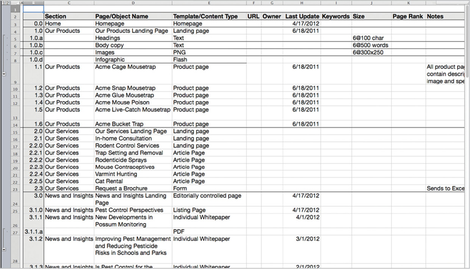

ARE WE REALLY going to talk about writing content for mobile, after we’ve spent so much time explaining how you can’t create content for a single platform? Here’s a neat trick: we’re going to use mobile as a lens to make all our content better, regardless of platform.

There is no “how to write for mobile.” There’s only good writing. Period.

That said, mobile gives us an opportunity to review our content within some tight constraints. Imagining how we’re going to take the vast expanses of content we’ve created for the desktop web (and in print) and squish it onto tiny screens will help us prioritize. Realizing that some of the dreck on our desktop sites doesn’t deserve to be on the mobile site will inspire us to edit it down—or remove it entirely.

How are we going to make this magic happen? We’re going to dip into our trusty bag of content strategy tricks, and follow the same processes and activities using the same tools and deliverables as we would for, say, a web content strategy project. But this time, we’re going to imagine that we’re doing them with the intent to put content onto a mobile website or app.

“But isn’t the whole point to get our content ready to go *anywhere?”* you might wonder? It is. Mobile is the catalyst that will help people get there. So use it as a tool. Feel free to get your content owners and business stakeholders thinking about the challenges of the smartphone form factor. If necessary, the fact that you’re using these exercises to improve *all* your content can be our little secret.

## CONTENT INVENTORY AND AUDIT

“If it shouldn’t be on the mobile site, it shouldn’t be on the desktop site either!”

This rallying cry for “mobile first” offers a glimpse of a fit and friendly future, one where content owners and stakeholders all agree to cut the fat out of a desktop website that’s grown too big for its pants. Once they imagine their bloated content squeezed onto a tiny screen, they’ll be motivated to trim it down.

Like any diet, it’s easier said than done.

Kristina Halvorson, CEO of Brain Traffic, is fond of pointing out that there is no “magical database in the sky” that will spit out the content for your website. I’m here to tell you that there is also no magical liposuction machine in the sky that will reach down and vacuum out your flabby content.

You’re going to have to do it yourself, the old-fashioned way: with a giant spreadsheet.

The basic tools for analyzing what you’ve got are the content inventory and the content audit—these don’t change just because you’re thinking about mobile. Looking at your content through the lens of mobile does provide some helpful perspective when you’re documenting the inventory and conducting the audit.

### Inventory

When you take a content inventory, you take an objective look at the content assets you have to work with. Typically, people conduct these when they’re redesigning a website and need to understand the size and scope of the project. You can follow a similar process when you think about getting your content ready to be displayed on a variety of mobile screens.

A content inventory is a quantitative assessment of your content. You’re not trying to judge the quality of the content yet (that comes later, in the content audit). You’re just trying to get your arms around what you’ve got.

#### Standard inventory categories

In preparing a content inventory, you might expect to gather some of the following facts about your content. Think of these as the columns in your spreadsheet (FIG 5.1):

* Unique ID number or code for each line in your inventory (numbers map to pages).
* Site section, or where it sits in the site hierarchy.
* Page title, including the main title and what appears in the meta `<title>` tag.
* Page URL.
* Content owner and/or person who last updated the page.
* Date the page was created and/or last updated.
* Expiration date assigned to the page, if any.
* Keywords that describe the page, or keywords used to index the page for search.
* Page rank or number of visits.
* Date the page was last visited, especially noting pages with no visits within a period of time (say, six months or one year).
* Content type or the CMS template used.

Because content inventories gather quantitative, objective data, it’s tempting to want to use an automated tool to crawl the site. Isn’t robotic work like this the thing machines are best at? Certainly, some of this data can be pulled directly from the CMS or gathered using a crawler, but there’s real value in the editorial insight you gain in systematically reviewing the pages, so think of automation as a supplement to human effort, rather than a replacement for it. (In general that mindset is what will protect us from our robot overlords.)

#### Mobile inventory categories

When you’re inventorying your content for a future life on mobile screens, there are other objective data you can gather.

Since getting content onto different screen sizes and resolutions will often require breaking it into smaller chunks than the desktop page, you need to have an approach to inventorying that tracks individual chunks or modules, not just pages. You might think of these as rows in an outline table (FIG 5.2):

* Unique ID number or code for each content chunk in your inventory (letters map to chunks within pages).
* Character or word count for headlines, subheads, and page summaries.
* Character or word count for body copy.
* Image dimensions or standard crop ratios or cut sizes—especially note large infographics or other dense images that won’t scale well to smaller screens.
* Content styling, especially in columns, tables, or lists, that may need to be presented differently on smaller screens.
* Content format, especially .pdf, .doc, .ppt, or other document formats that won’t condense well on smaller screens.
* Content presented using Flash or any other technology that just won’t work on some mobile devices.
* Common modules reused across pages (for example, in the right column) which you may need to handle differently on smaller screens or even eliminate on less capable devices.
* Content chunks that may be stored in different database locations, which may affect how easily you can repurpose them (for example, user comments are often stored in a different database from managed content).

Inventorying at this level is something most automated systems aren’t set up to do easily. Make friends with your tech team—they’re the ones who can help you figure out things like character counts and database locations.

#### Representative sampling

If you’re freaking out because your website is simply too big to inventory, don’t despair. Just like it wouldn’t be possible to survey every single person in your country, you don’t always need to look at every single page in your site. Instead, you can take a *representative sample* of pages.

When inventorying, it’s most important to set up your approach to how you’ll tackle the problem. Before diving into your full inventory, do a quick pass through the site to determine:

* **Breadth of your audit:** do you need to look at every section, or will it be sufficient to focus on a single section?
* **Depth of your audit:** do you need to dig into every level of the site, or can you stop at a certain point, say four or five levels down?
* **Range of content types:** it’s less important that you see every unique page, and more important that you understand the different content types—a quick review can give you a sense of whether you’re dealing with many consistent pages (like article pages or product pages with a regular structure) or lots of one-offs.

Remember, your inventory isn’t a document you complete once and then stick on a shelf to gather dust. You can and should keep adding to it as you go through this process.

### Audit

By now, you understand that you’re not trying to create a totally separate mobile website, with a unique subset of content—right? Keeping in mind that your goal is to apply any improvements to *all* your content, you can still conduct this audit with mobile in mind.

You might imagine, then, that you’re trying to decide whether each piece of content is worthy of being migrated to a new mobile website. What if your stakeholders and content owners had to physically move each piece of content to its new home? Would it merit the effort?

#### Audit criteria

To conduct your audit, you may wish to evaluate your content against criteria like the following:

* Subjectively, is each page or content chunk too long, too short, or just right? Length isn’t inherently a problem, but you’re trying to assess whether you can easily break longer pages into shorter chunks, or whether it makes sense to keep the whole document together.
* Is the text wordy or does it ramble? Is the language filled with jargon or marketing-speak? If you imagine a smaller screen, could you edit the text and clean up the wording without losing any meaning or value?
* Does each page or content chunk get to the point? Are the main ideas presented quickly and succinctly—in the first paragraph or in the page summary? If you imagine a user glancing at a mobile screen, would she get the main message right away?
* Is the content structured into chunks say, broken up with headings, or with teaser-sized chunks on landing pages? Does each chunk or paragraph present one and only one topic?
* Is the content up-to-date? Would anyone say “we don’t need to put that content on the mobile website, it’s too old”?
* Is the content useful and important? Would your stakeholders say that each page or content chunk is a must-have or a nice-to-have on mobile?

## ANALYSIS

The point of doing an inventory and an audit isn’t to create documentation—it’s to drive change within your organization. Once you’ve taken a deep dive into your content, you need to communicate your findings and recommendations to your stakeholders and get them to agree on next steps. A gap analysis can help you figure out how to get from where you are to where you want to be.

### Gap analysis

By the time you’re done with your audit, you should have quite a bit of data to help inform your decisions about what to do with your content next. Based on your audit criteria, you have some decisions to make.

Your job, then, is to use mobile as a filter, to persuade your stakeholders and subject matter experts to act on each and every piece of content. Those actions will be:

* **Keep** it as-is and include it on the mobile website.
* **Revise** and edit to tighten up the writing or to create a more mobile-friendly format.
* **Delete** it, because it’s irrelevant, not useful, or outdated.
* **Create new** content, perhaps to take advantage of new capabilities on mobile devices.

You’ll probably want to add a new set of columns to your spreadsheet—or even a new sheet to your workbook—to help you track all the decisions you’ve made and actions you need to take next.

### Communicating findings and recommendations

Mobile isn’t magic. Simply waving a smartphone in a stakeholder’s face and pointing to the smaller screen size won’t necessarily help you convince him that his precious content isn’t worthy of appearing on your mobile website. As with any evaluation process, the art of the content audit is the art of persuasion.

#### Education

Many of your stakeholders will be unfamiliar with mobile best practices—even people who are intimately familiar with making decisions about how the desktop web should function. As a result, you may encounter resistance and knee-jerk reactions, which are usually rooted in fear of not understanding how and why mobile is different. Use lots of best practice examples from other mobile websites and apps to make your point.

#### Content recommendations

Your job in presenting your content audit is to convince your stakeholders that the content needs to change. Think about which formats will be most persuasive to them. Some organizations value quantitative decision making. If that’s your company, then score all your content on a rating scale, and show them charts and graphs to illustrate your main points. Other companies will be persuaded if you show them usability evaluations, competitive reviews, or even your expert opinion. Tailor your approach to how you present your recommendations so it’s aligned with how people make decisions.

#### Desktop first!

Some of your constituents may still be imagining that you’re planning to create a mobile website that contains less or different content than the desktop. By using mobile as a way to force them to filter, you may have allowed them to keep believing that the desktop is going to stay the same. Now, you’ll need to get them on board with making edits to the content across the board. Emphasize the benefits of simplifying content for all users, and the pain of having to maintain multiple versions—enlist the CMS in your argument and explain that it prefers to serve one set of content.

## EDITING

Imagine all you had was a mobile app or mobile website. No vast expanses of desktop screen real estate. No way to present every possible option on the screen at the same time, assuming that the user would figure it out. No presumption that your reader was sitting, transfixed, poring over every word.

With the limitations of a mobile screen as a guideline and a barrier, you’d naturally have to write differently. You’d get to the point. You’d put the most important information up front. You’d remove all the marketing jargon and fluff. You’d write short, declarative sentences. You wouldn’t use a long word when a short one would do. You’d make every word earn its place.

Writing this way isn’t just good writing for mobile. It’s good writing for everyone. Here’s how to use mobile to help edit your content.

### Messaging

People have always tended to scan, rather than read, on the web. Desktop users skim their way through the text, alighting on headings and links and bullet points, searching for the information that matters to them.

Unless you’re completely focused on what you want to communicate, you can’t assume that your reader will get the message. Successful web writers know that they may only have a few seconds, a glance at the screen, to get the key idea across. Once they’ve grabbed the reader with a message that resonates, they might earn a bit more attention—but they can’t squander it. Additional information needs to answer the user’s follow-up questions and reinforce the main idea.

What was true on the web is even more true on mobile. It’s not that people *won’t* read on their mobile devices—it’s that you have to earn their attention more than ever.

The limits of mobile provide a useful focusing device. When revising your content, use the constraints of a mobile screen as a guideline to help you hone your message and make sure it gets through (FIG 5.3):

* **Primary message:** what’s the main idea you need to get across? Figure out what that is, and make sure readers can apprehend it in a glance at the screen. This primary message may come through in the headline, the summary, or the text’s first sentence or two. Ideally, the primary message for any given page reinforces your overall brand and mission.
* **Secondary message:** assuming you’ve got their attention, what do you want them to know next? Once you’ve piqued your reader’s interest, you can assume she’ll be willing to read a bit more—maybe ten seconds or so, which is about the amount of time it would take to read the text on a standard mobile phone screen. (Assume a standard screen will fit approximately 100 words, give or take, depending on the design.) Answer her key questions: what is this, and why should I care? Remember, they’re still likely to scan the screen looking for keywords that meet their goals.
* **Supporting messages:** what’s next? What else do they need to know? Perhaps these points take the user to supplementary pages, or present related ideas in a list of bullet points. The key here (as always) is they’re concise, loaded with words the user is scanning for, and make the user feel confident in her next tap.

### Revisions

Here’s a summary of guidelines to use when you revise your content for mobile. Just remember: these recommendations apply regardless of platform or channel. Mobile is just a useful constraint:

* **Plain language:** use shorter, simpler words. Write short sentences and avoid convoluted sentence structure.
* **Objective language:** neutral language is easier to read and more credible than marketing fluff. Use words your user will know, not jargon.
* **Be concise:** aim to get your main point across on a single screen, which is approximately 100 words. Ruthlessly delete unnecessary words. (That doesn’t mean all anyone will read is a single screen—but it provides a helpful editing guideline.)
* **Write headings as links:** assume that headings and subheads could be repurposed as navigation. Make them actionable and fill them with trigger words—words that users themselves would say if asked to describe what they’re looking for.
* **Write the first sentence as a summary:** assume that the first line of the page or section could be repurposed as a navigation summary. Put the main idea and important keywords in the first sentence.
* **Inverted pyramid:** don’t bury the lede. Start with the conclusion. Put the most important ideas first. Bottom line up front (BLUF).
* **One topic per paragraph:** when readers scan the page, they look at initial sentences for main ideas. If additional ideas are presented in a single paragraph, users are likely to skip over them.
* **Highlight keywords:** readers scan for hyperlinks in text, so this is a particularly effective way to highlight. You may also bold keywords, but avoid color variations or underlining words that aren’t hyperlinks.
* **Bulleted lists:** use bullet points to make supporting ideas easy to scan.

Take your cues from Comcast. They edited and simplified the page that explains your bill, reducing the length and complexity of the language without losing any of the meaning (FIG 5.4).

## COMING UP

By now, you should have a plan for how to move forward with your content strategy—or at least, be headed in the right direction.

You’ll also have inventoried, audited, and analyzed your content so you know what needs to change. You’ve edited your content—or removed it entirely—so it provides maximum value.

Now, it’s time to look at how your content is structured. What specific changes do you need to make to the way you architect your content to support multi-channel publishing?

After that, we’ll look at what needs to change in your internal organization. How will your people and your processes need to adapt to adaptive content?
