PRINT IS SO EASY, RIGHT? You put the ink on the paper and you know it will stay there. You don’t have to worry about updating it all the time. Want to make changes, or release a new version? Better chop down some more trees. That’ll take some time, so you’ll have a chance to think carefully about your revisions.

Your iPad app isn’t print. Neither is your mobile website, your Android app, or any other mobile “version” you might want to publish. Neither is your desktop website. Digital content is dynamic, flexible, fluid, and always updated.

Sound obvious? Unfortunately, we’re still trying to get there.

The legacy of print is still with us on the web. We’ve moved from imagining how our content will look and where it will live in a printed document to imagining how it will look and where it will live on a webpage. We treat the desktop web like a dynamic document—sure, we have the flexibility to update it whenever we want, but it’s still the one and only place our content will ever “live.”

Those days are over.

How do we take what we know about information architecture and navigation design for mouse pointers, and adapt and evolve those models so they will also work for meat pointers? If we recognize we have to create new, flexible structures in our content, how do we do that? If we want to stop thinking about “pages” and start thinking about “packages,” how does our editorial process need to change?

We’ve got work to do. Let’s look at some key content structures and talk about what needs to evolve.

## WAYFINDING

The web is all about action verbs. We click. We search. We navigate. We select. On every screen, we present users with options and ask them to take an action. Successful content puts the user in the driver’s seat, helping guide them to where they want to go.

Jared Spool, CEO and Founding Principal of User Interface Engineering, often writes and speaks about the “scent of information” and how to write links using “trigger words”—words that inspire users to act because they make it obvious what will happen when users click on them. He says, “It shouldn’t be news or a surprise to anyone in the world of website usability that having clear links that describe what the user will find after clicking is a priority in the design process” ([http://bkaprt.com/csm/63](http://bkaprt.com/csm/63)).

What’s true for the desktop web is even more important when users navigate your content on mobile. Smaller screen sizes mean that the user may have to drill down further to get to the content. Slower connections (paid for by the megabyte) mean the cost-per-tap may be higher. And because users just aren’t as familiar with navigating on mobile, it will be easier for them to get lost. All the more reason to make sure that your wayfinding content—labels, summaries, and other microcopy—helps the user feel confident she’s on the right track.

### Don’t rely on navigation labels alone

Tap. Refresh. Scan. Back. Tap. Refresh. Scan. Back.

How many times do you think your mobile user will do that before getting frustrated and give up?

If you’re still imagining the mobile use case—the pressed for time, on-the-go, distracted mobile user—you’re not going to make that user’s life easier simply by putting location-based services on the home screen. Serving the mobile user means ensuring that she has enough context to quickly and easily find what she’s looking for, even if it’s several levels deep in the site. (Sounds a lot like what it means to deliver a good experience for the desktop user, doesn’t it?)

A couple of taps off the main screen is when most mobile experiences start to break down. The architecture and design attention that gets lavished on the homepage and the main navigation bar doesn’t make it to some of the more pedestrian screens, the way stations along the route to the content. Instead, users get a long list of links, many of which don’t make much sense. How do they know which one to tap (FIG 6.1)?

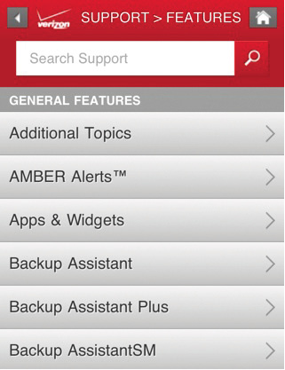

### Do provide a short teaser

> “In its purest format, progressive disclosure is about offering a good teaser.”
> 
> —FRANK SPILLERS ([http://bkaprt.com/csm/64](http://bkaprt.com/csm/64))

Progressive disclosure orients users in steps or stages that reveal more complex information as they go, helping them make good choices as they complete a task or navigate information. It’s an old concept in human-computer interaction, first applied to early software interfaces in the 1980s. Its usefulness has been proven again and again on web-based interfaces, and it’s easy to see how it applies to the constraints of smaller mobile devices.

Writing a good teaser is one of the simplest things you can do to help your users orient themselves so they can find what they’re looking for. Unfortunately, it’s often one of the most overlooked. Write a sentence or two that describes each link. Fill that description with trigger words—words that users themselves would say if asked to describe what they’re looking for (FIG 6.2). You’ll ensure that each tap adds value, and reduce the risk that users will ping-pong back and forth between screens.

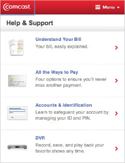

### Truncation is not a content strate…

Where are all those teasers going to come from? If they don’t exist already, then you’re going to have to write them (and make sure there’s a home for them inside your CMS). Don’t fall into the trap of thinking that you can simply display the first sentence or two of your body copy, then drop in an ellipsis.

Unless you intentionally wrote the text to be a great teaser, it probably won’t be. Crafting a teaser is an art—and it’s different from writing the first sentence or two of your content.

Amazon does an admirable job of making their vast product catalog accessible on mobile devices, and they gain significant business value by enabling shoppers to purchase from their smartphones. But they miss the mark in presenting navigation teasers that entice users to take action. Why? They’re recycling content from the desktop site and truncating it for summaries (FIG 6.3).

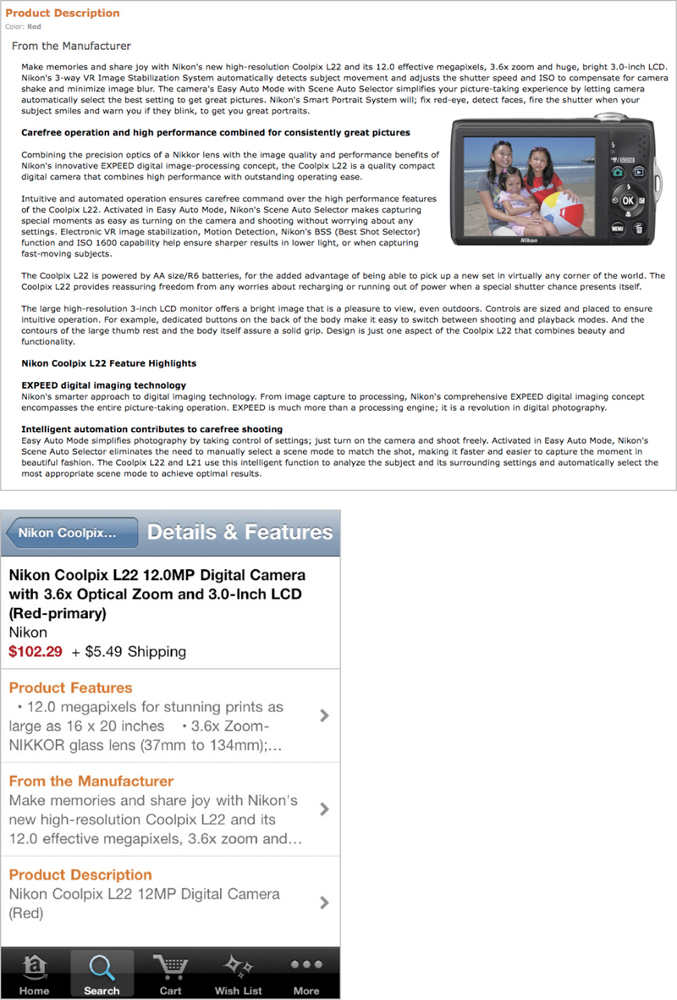

#### Not written for reuse

Taking text intended for use on the desktop site means you don’t know what you’ll get when it appears on a smaller mobile screen. Information like the name of the product is duplicated over and over, wasting space and providing little value to the user.

#### No trigger words

The whole point of writing a teaser is to stuff it full of the words your readers are thinking of when they describe what they’re looking for. The first sentence or two of Amazon’s body copy wasn’t written with that goal in mind, which means that instead of tightly written navigation copy designed to get users to tap, they present fluffy marketing copy that doesn’t communicate anything.

#### Not formatted appropriately

Amazon has all kinds of formatting lurking in its big blob of body copy. The bulleted list shown here was never intended to be taken out of context and crammed into a tiny tap target. Same goes for subheadings, pull quotes, tables, and other formatted text.

## PAGE TITLES AND HEADLINES

What’s in a page title? Would a page by any other name be just as findable?

Whether it’s a product page, an article, a blog post, or a support topic, what you call your page is crucial to helping users find it.

Page titles don’t just appear at the top of the page. Headlines also appear in links that help users find that page. So, your page titles and headlines will now pop up in more and more places: links on homepages and landing pages (both desktop and mobile), lists of links in sidebars and other related content, search results (both internal and external), in social media like Twitter and Facebook, and, yes, in their rightful place at the top of the screen. Given all these variables for how and where page headings might appear, it’s helpful to think of them as a system.

### Don’t truncate headlines

This should go without saying, right? Just because you can’t count on having a large screen size or high resolution display doesn’t give you license to chop off page titles or headlines wherever you feel like it. *The Daily Beast* commits a litany of abuses on their mobile site—truncating headlines (presumably because there isn’t enough space?) and then wasting space by repeating the author’s byline in two places (FIG 6.4). Space may be at a premium, but use it wisely.

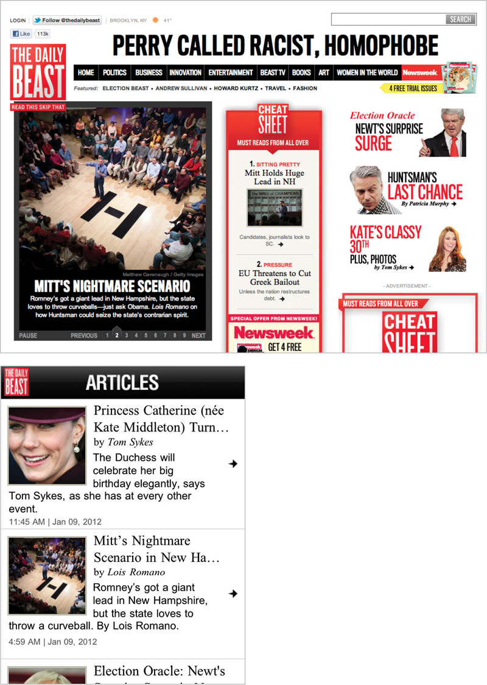

Fig 6.4: Apparently *The Daily Beast* needed to save space so they could include a byline and then repeat the author’s name in the summary.

But what if the constraints of your device context or screen real estate mean that your headline won’t fit? You will need to create multiple versions of headlines to support all these different uses. Before you freak out about all the extra work implied by that, take a step back and think about how to create a system of headlines.

### Do write a system of headlines

I get to look a lot of companies’ content management underpants. Peeking inside a CMS, I often find writers asked to create some combination of the following:

* Article headline
* Teaser headline
* Homepage headline
* Landing page headline
* External SEO headline
* Internal search headline
* Facebook headline
* Twitter headline
* iPhone headline
* Android headline

Can I get a chorus here? *Don’t create content for a specific context.* Sing it!

Instead, tell your writers to focus on writing a few headline types, and then have each platform show the one that best fits its constraints. By devising a system of headlines that will cover a range of possible options, you can publish the right headlines and page titles to all these different contexts, without truncating the text.

This all comes back to your content management system. You need a tool that encourages your writers to create just the right number of headlines—so that the right headlines can be served up to each platform, as needed.

For starters, consider two major variables:

#### Length

For Twitter, the most extreme example, you have only 60–100 characters to work with, since you will also include a link to your website and potentially cite a source. A headline that’s short enough for Twitter could work well in mobile contexts too.

You might just write one short headline and use it everywhere, but why limit the capabilities of platforms that can show more? You can use longer versions (100–200 characters) to provide more information in platforms that can support it.

#### Tone and style

Who are you writing your headlines for: people or robots? Of course, you want to write a headline that’s meaningful—even delightful—for the humans who are looking at your content. But that doesn’t mean you shouldn’t also optimize for search engines. You can do both.

Write two different versions of your headline. One that’s designed for human readers, who appreciate style, humor, and even the occasional pun. Write a different headline that’s crammed full of SEO-friendly keywords, and let Google (and your internal search engine) chew it up and spit it back out.

Taken together, that gives you four possible options:

1. Short, colloquial
2. Long, colloquial
3. Short, SEO-optimized
4. Long, SEO-optimized

You might not even need all four of these options, based on the constraints imposed by the channels you serve and your design templates. You might even work out a different system along different variables that works better for your needs. The point here is to write headlines that conform to general guidelines for length, tone, and style, and then send the right versions to the right platforms—don’t create a dozen headlines to serve every possible context.

#### Super combo

Want extra flexibility in your headlines? Consider writing a super-header that can be displayed separately from your headline (say, called out in a different font or type size) or attached to your headline with a colon. Now you’ve got a short headline, a long headline, and perhaps even some category metadata. *The New York Times* employs this approach to great effect, giving them flexibility to show headlines in lots of places and contexts, achieving maximum variety with minimum effort (FIG 6.5).

<figure>

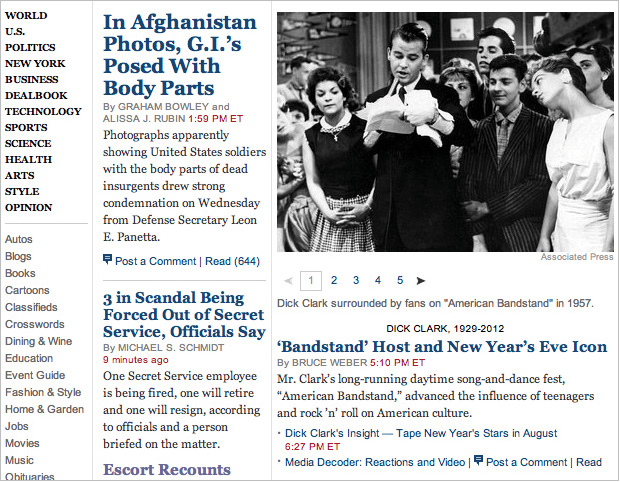

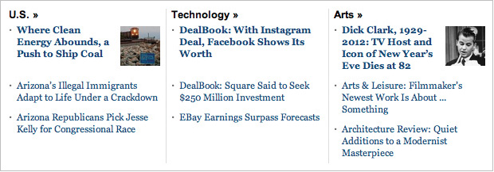

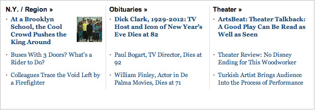

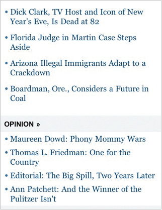

Fig 6.5: <em>The New York Times</em> writes surprisingly few headlines, but they can be combined in different ways and presented in various contexts.

</figure>

## SUMMARIES

Call it a summary, a deck, a teaser, or a tout, you need a short description for every long page of content. Not sure where you’re going to use this summary? Once you’ve got it, you’ll find all kinds of uses for it. It will come in handy for navigation teasers, as previously discussed. You can also use it on landing pages, sidebars, search results and SEO meta-descriptions, and in social media like Facebook or Pinterest.

Here’s the secret: get in the habit of writing a summary whenever you create new content. It’s much easier to summarize the text at the same time you create the content than it is to treat it like a separate process—or worse, have to go back and fill in summaries later, when you realize they’re necessary on a new platform like mobile.

### Don’t truncate body text for summaries

Were you hoping you could just recycle your body text? Have your designer decide how much space your text will receive? Have your developer assign an arbitrary character count in your CMS? Drop in an ellipsis when you run out of room?

It didn’t work for headlines and it didn’t work for navigation teasers. It’s not going to work here either.

Blockbuster has no systemic way to handle summaries for its desktop or mobile applications. Instead, they just cut the text off at an arbitrary break—and that cutoff point varies from platform to platform. It’s frustrating for the user not to be able to see the full summary—or to click for more information, only to be rewarded with a paltry few additional words (FIG 6.6).

<figure>

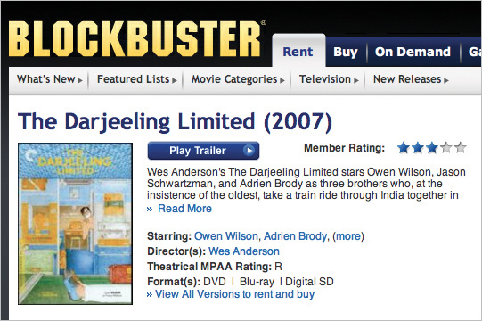

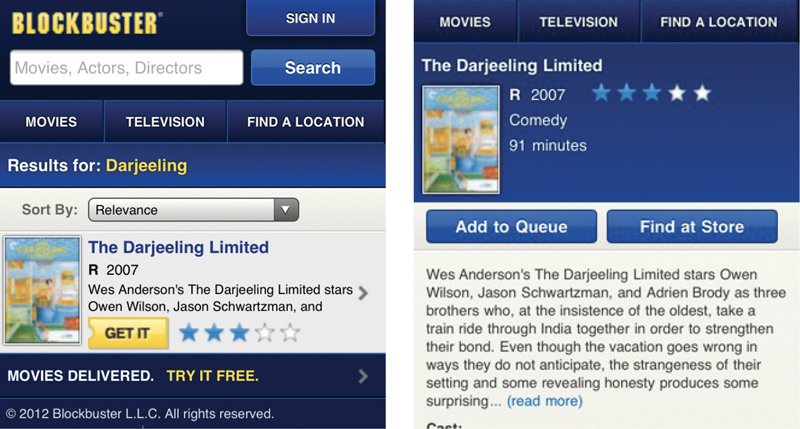

Fig 6.6: Blockbuster truncates text at random. The length of summaries is dictated by the design (or by an arbitrary character count) rather than by a meaningfully defined chunk of content.

</figure>

Blockbuster recently filed for bankruptcy, largely due to competition from internet upstart Netflix. Netflix runs on over 400 different device types ([http://bkaprt.com/csm/65](http://bkaprt.com/csm/65)). They offer different experiences tailored for each platform—but only two different sizes of summaries. Each platform can choose which size of summary to display, and it doesn’t get truncated (FIG 6.7).

<figure>

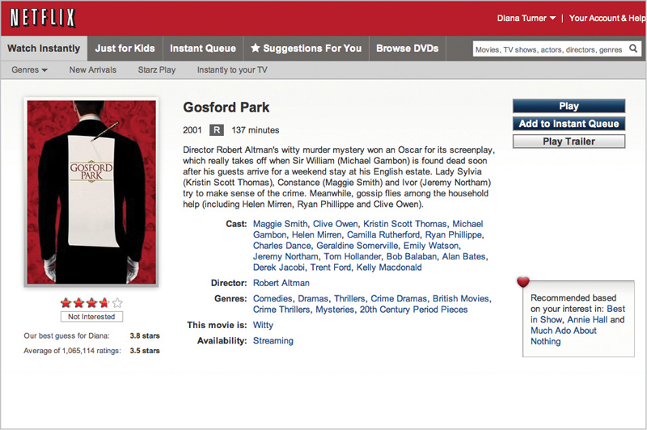

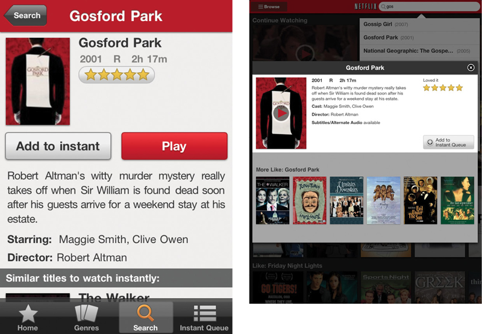

Fig 6.7: Netflix writes a short and long version of each summary, each of which appears in a variety of contexts—desktop, mobile website, mobile apps, tablet apps, and search.

</figure>

### Do write a system of summaries and teasers

The magic happens when you create a single “content package” to hold *all* the chunks associated with a particular content type.

For example, don’t create an article and then treat its deck like a chunk of text that only “lives” on the homepage—you’ll lose the opportunity to reuse that deck in other contexts. Don’t write a product description without also writing a summary (or two)—and ensure that the product “tout” that advertises it on landing pages is attached to the product itself. If you need to write a “meta summary” for SEO purposes, treat that as part of the same system.

See how this all keeps coming back to your content management infrastructure? Your CMS should encourage authors to create summaries—different versions of summaries as needed—guiding them through the process and explaining how each will be used. Your CMS then also needs to enable each platform to pull the proper summary for its purposes. Rather than creating one-off bits of content that live on different pages or in separate websites, each with their own editorial workflows, your CMS helps your content creators think about content packages (FIG 6.8).

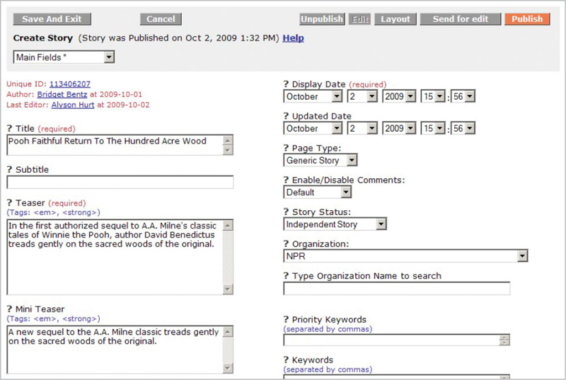

## BODY TEXT

Multiple headlines: check! System of summaries: check! Content package in the CMS: check!

Whoa. What about all these long pages of content?

As discussed earlier in the section on writing and editing, there’s no such thing as writing for mobile. There’s only good writing. You should think about how to improve the quality of all your text. Once you’ve done so, there’s no need to change the substance or the style to make it more appropriate for mobile.

The challenge, then, is in how you structure your body text. This is where the proverbial rubber hits the road, as far as getting your content on mobile is concerned. What’s the right way to take a long article, document, product spec, or instruction manual, and display it on different screen sizes? How do you chunk your content so it’s easy to read, regardless of its visual presentation? When does it make sense to break up long pages, and when does it make sense to keep them together?

### Don’t paginate unnecessarily

Truncating headlines is bad. Truncating navigation teasers is bad. Truncating content summaries is bad. Truncating body copy is…

Yes. Bad.

One of mobile’s most persistent myths is that content has to be short. Mobile users only want the fun-size candy bar version, preferring to save the full-size Snickers for when they’re back at their desk. This misguided mindset gets drilled into designers, and as a result they fear the long page. How to avoid having mobile users wade through long passages of text? Why, break it up into shorter screens!

It’s as true on mobile as it is on the desktop: scrolling is not bad. Scrolling is good!

On a touchscreen device, scrolling is much easier than paginating: a fluid swish of the thumb versus a carefully placed tap. Even if your user has to navigate with a four-way rocker, it’s still easier to scroll than to select the link for “next page.” If you’re aiming at a user who’s reading with one eye and navigating with one thumb, scrolling wins every time. So why force users to tap instead of scroll?

Advertising-supported desktop websites often include page breaks because additional page views drive revenue. If ad revenue is a motivation on mobile, then you may need to use a similar calculus to determine where page breaks should appear. *How Stuff Works* drops a page break in the middle of an article on their mobile website, even though the same article on the desktop can be read all on one page (FIG 6.9).

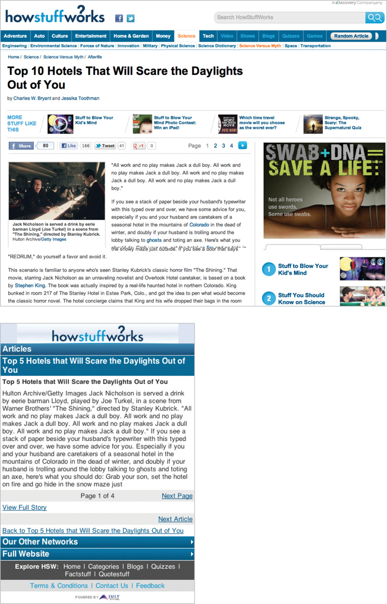

For other types of mobile content, it doesn’t necessarily make sense to force a page break. If you do choose to break up text, do it for a good reason. *Cooks Illustrated* requires users to tap back and forth between the ingredients listing and the recipe instructions, even though it would be much simpler to have all that information on one page (FIG 6.10).

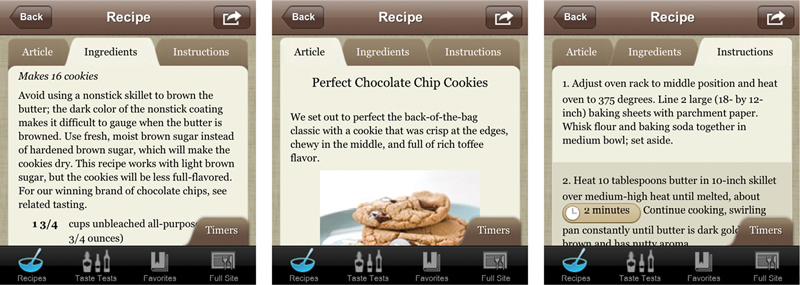

### Do make it easy to jump to a section

The joy of whizzing through a page of text with a quick thumb swipe quickly wears thin when you’re scanning for a specific piece of information you know is buried in the text. In the same way that it’s important to provide a good teaser when the user is navigating to find a page, it’s also important on mobile to make it easy to jump to a specific section of a page without scrolling.

#### Anchor links

Ancient hypertexts point to a good solution, one that would have worked just as well in 1995: anchor links. By pulling out headings and listing them at the top of the page, users can easily jump directly to a section without scrolling. Anchor links also serve as signposts for the main sections of a page, helping users figure out if they’re in the right place (FIG 6.11).

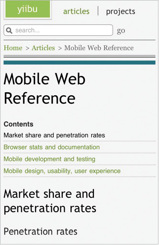

#### Show / hide

A similar solution puts each sub-section of content behind a control that can be expanded. This is particularly useful in situations where users are not likely to read the whole document, but will instead pick and choose which sections to read. However, if there’s a chance users might like to read the whole thing, it would also be helpful to let them expand (and collapse) the entire page at once, so they don’t have to manually tap into every section (FIG 6.12).

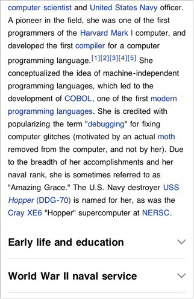

## TABLES

Information arranged in tables presents one of the most vexing problems for presenting content on mobile devices. Tabular information is, by definition, intended to be presented at wider screen resolutions than many mobile devices will support. Without being able to count on a certain screen size, how is it possible to ensure that table information won’t get cut off?

### Don’t lose table formatting

It’s revenge of the blobs: content formatted for reading in table cells that gets reflowed as a single column on mobile devices. Sure, the content is still accessible, but the desired reading experience is lost. For example, side-by-side statistics on two College Bowl teams on ESPN get rendered as one long page—losing the opportunity to compare them (FIG 6.13).

<figure>

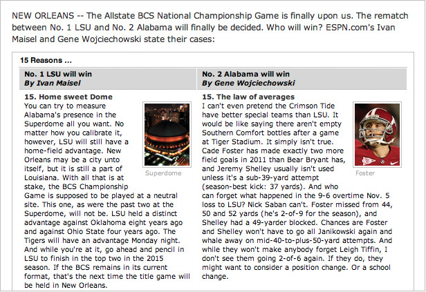

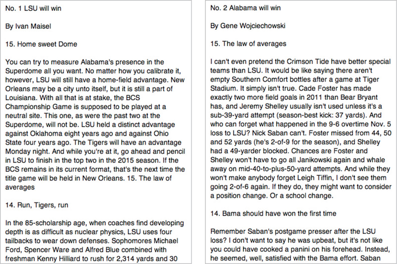

Fig 6.13: Content from ESPN that’s intended to be read side-by-side gets dumped into a single column on mobile. A better solution might be a slideshow presentation that compares two at a time.

</figure>

This can be a difficult problem, especially if all that content is stored in a blob in the CMS, as finding these cases may elude all but the most manual, labor-intensive solutions. When you’re inventorying your content, look carefully for tables that may break when moved to mobile. Enlist the robots to help you do this—for example, use an automated tool to find places where table tags appear in the page body.

Dealing with this problem will undoubtedly require some changes in your CMS. Based on your inventory, you should determine if the number of tables is small enough that you can handle them as one-offs. If you have lots of tables, then you will probably need a new content type in the CMS to handle these situations. If you’re dealing with many tables, you’ll need a way to programmatically reformat them without human intervention—but that requires you to call them out as a separate content object from the start.

And be patient with yourself: it may not be possible to review every single page of content with a table in it before it goes live on your mobile site. Consider offering mobile users a way to flag content that’s not working—an alert that says “I can’t read this table” gives the user a sense of control over a broken situation, and gives you useful pointers to what needs to be fixed. You’ve turned an ugly error into a win-win for both you and the user.

### Do ensure tables are readable

It goes without saying, right? You can’t just smush a table designed for a much larger screen into a smaller space. Table columns will collapse to a point where they’re too small to contain the content within, or the text will shrink until it’s a meaningless blur (FIG 6.14).

.")

While horizontal formatting fits easily on a desktop screen, narrower mobile screens simply can’t display the full table width. Provide an alternate version where you present information in a vertical list, or align the table vertically rather than horizontally. Again, this may require defining tables as a separate content type in your CMS.

### Do use progressive enhancement

Even if you’re not developing a mobile website using responsive design, you can borrow progressive enhancement techniques to make your tables adapt to different screen sizes. If it’s possible to choose which columns are most important, and which are less essential, then you can take a page from the progressive enhancement playbook and display only the critical columns on smaller screens. Users can tap to select additional columns if they want to see the full table. (This approach would work well for a table of financial information, but wouldn’t work for the garment size charts example, since in that case every column is equally important.)

The details of how to code this in markup are well beyond the scope of this book, but more information is available in the resources section in the back of the book.

## IMAGES AND INFOGRAPHICS

Did I say *tables* were one of the most vexing problems we face in presenting desktop content on mobile? Tables are a cakewalk compared to the truly formidable problem that images pose.

The solution to this problem is complex, because it requires changes on both the front-end and the back-end. We’ll need to crop different image sizes, which obviously means changes to our production workflow, and likely requires changes to existing assets. What’s more, fixing this problem means we’ll need to change the way we handle images in HTML.

How’s this going to work?

### Don’t shrink large images

“I’m just gonna take this giant image and crunch it down so it fits on a 320×240 screen, okay?” No, this is not okay.

First, the image will likely be unrecognizable when rendered at a smaller size. Details that are crisp and clear in a large image may be a blur at a smaller resolution. And if it’s an infographic that includes text? Forget about it (FIG 6.15).

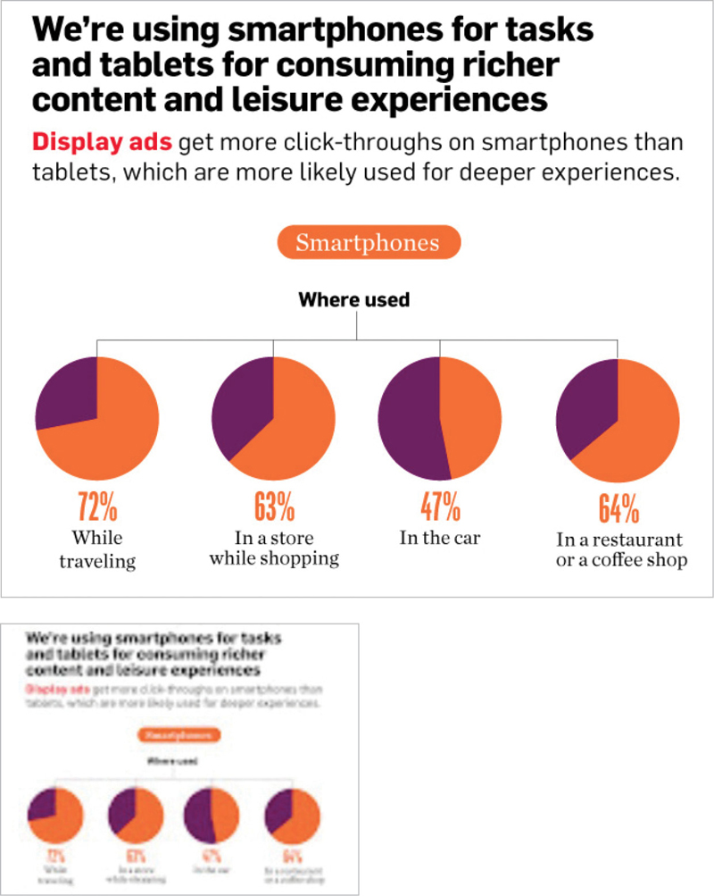

Second, the larger image requires more bandwidth to download over a cell connection. A heavy image that provides less value? Not a good content strategy.

Instead, you’ll need to prepare multiple versions of images (see below for more information about creating a system of image crops). The internet’s love affair with dense infographics may need to find a new outlet—consider breaking large infographics down into smaller chunks presented as a slideshow. (Or, really, just quit it with the overly complex infographics and present the data more simply, in text.)

Now, if you’re sitting on thousands or hundreds of thousands of large images, re-cropping them all would be a massive undertaking. In the short term, if you’re forced to automatically resize large images on mobile, at least make sure users can tap to get to the full-size image.

In all cases, make sure that the information shown in the image is also communicated in the text, either in the body copy, in alt text, or both. That’s not just good for mobile—it’s good for accessibility and SEO too.

### Don’t truncate large images

“I’m just going to chop off the part of the image that won’t fit on a mobile screen, okay?” (FIG 6.16)

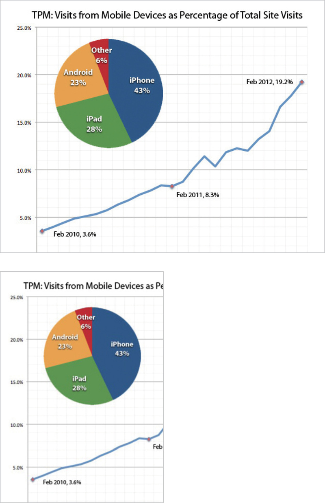

Let’s not even dignify this one with a response.

### Do create a system of image crops

It’s likely you will need to cut additional image sizes to support different screen sizes. As with all other content types, you should not plan to cut images for a specific context. Don’t cut one size that’s the perfect fit for your mobile website, and a slightly different size for your iPhone app. That way lies madness.

Rather, your plan should be to develop a system of image crops. Cut the smallest number of image sizes that will serve the widest possible range of contexts and screen resolutions. Assuming you can scale images down somewhat (not a lot) to fit different screens, you should be able to get away with four to eight different sizes. Exact image dimensions will be based on your specific requirements.

### Keep an eye on responsive images

You don’t have to go very far into responsive web design before you find very smart people banging on how to get HTML, CSS, and JavaScript to handle different image sizes. Covering the ins and outs of this lively debate is outside the scope of this book, but more information is available in the resources section.

## YOU’RE ALMOST THERE

We’ve talked strategy and planning—you’ve figured out how to set a direction for where you need to go. We’ve discussed writing and editing, and your content should be simpler and easier to read. And we’ve gone over how your information architecture might change to adapt to new content structures.

Now, we need to look inside, at how your organization works. Developing a content strategy for mobile won’t work if all you look at is your content. You have to change your people and your process too.
