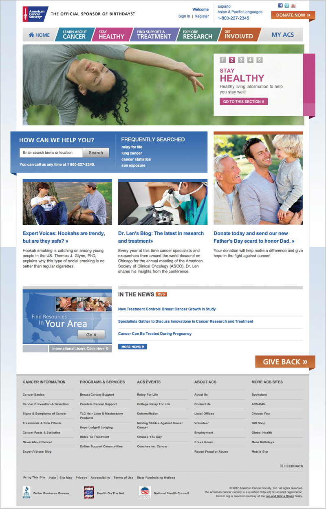
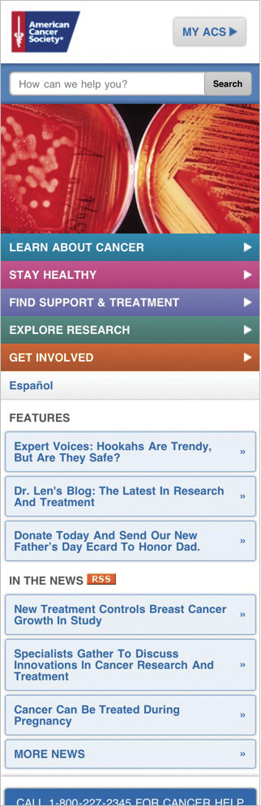

## CONCLUSION: IT CAN BE DONE

Are you looking dubiously at your desktop web content (not to mention all your content stored in PDFs, Flash videos, and hieroglyphic scrolls) and wondering if it will *ever* be possible to get it all on mobile?

You can. And you will. Because one day you’ll realize it’s not a nice-to-have. It’s a necessity.

### Cancer.org did it

The American Cancer Society (ACS) publishes [cancer.org](http://cancer.org), a website aimed at helping people prevent cancer, detect cancer early, get support and treatment, and contribute to the fight against cancer.

If ACS were like most organizations, they might have thought the following:

“Not that many people are visiting cancer.org from their mobile browser.” Or, “Surely the desktop website works well enough for mobile users.” And maybe, “Let’s just focus on the mobile use case, for the on-the-go cancer patient.”

ACS thought something different. David Balcom, Managing Director, Digital Platforms told me in an interview, “We felt it was a life-saving imperative to have *all* of our content on mobile.”

ACS decided against publishing a subset of their mobile content for a couple of reasons. First, they reviewed their analytics data and realized that people were using the desktop site from mobile browsers. This made them wonder if they needed to deliver *all* their content on mobile, instead of just a subset.

Then, they compared data about Americans who were more likely to use mobile devices to access the internet with data about people who are less likely to be screened for cancer. African Americans, Hispanics, and low-income Americans are less likely to have access to early cancer detection—and they’re also more likely to use mobile phones to access the web ([http://bkaprt.com/csm/70](http://bkaprt.com/csm/70)). ACS concluded that some of the most important people they needed to reach might not be able to see their content unless it was optimized for mobile.

ACS realized they needed to act. They worked quickly to get their mobile website up, working along with development partner Moovweb. But ACS had to overcome some challenges to get their content on mobile. According to Balcom, “Your CMS, your content, and your UX all have to line up.”

Like many organizations, they weren’t blessed with a nimble CMS that would easily facilitate everything they wanted to do on mobile. They explored the possibility of building additional publishing workflows into their CMS to give them more editorial control over which content was published to mobile, but concluded it would slow them down too much. Balcom said, “If we had created a separate workflow, it would have added a year to the process.” Instead, they chose to have a single publishing workflow, with decisions about which content to show or hide happening at the server level, which reduced their time to market significantly.

Similarly, they faced technical challenges that precluded implementing a responsive design, focusing instead on creating separate templates for mobile. Balcom says they found that “responsive would have added significant time to the project,” and they felt they were better off focusing on providing a great experience for smartphone users. While that decision was right for ACS, other organizations might find that a responsive design solution would be faster—it just goes to show that there’s no one-size-fits-all strategy when it comes to mobile publishing.

ACS had at least one important thing in their favor: they’re known for having clear, concise, credible content. Because their desktop web content was already well written, they were able to easily translate it to the mobile screen without rewriting or restructuring it. Balcom says, “It’s not that it was designed and written for mobile, it’s just good content.” Other organizations can take this to heart: even if you’re just getting started on your mobile strategy, improving your content now will benefit you in the long run.

Because they’ve been able to deliver a satisfying mobile experience, ACS has nearly doubled the number of people visiting the site from a mobile device. The increase in visits from mobile browsers shows that there was pent-up demand for better mobile content. By optimizing their content for mobile, they’re getting valuable—even life-saving—information into the hands of the people who need it (FIG 8.1).

<figure>

Fig 8.1: Cancer.org shows all their desktop content in a mobile-optimized website too.

</figure>

The secret to delivering a great experience on mobile is something every organization can do, starting right now. It’s content strategy. Balcom concludes:

> You have to get it into the bloodstream of the organization. You cannot be successful without thinking mobile from the beginning. It’s not as expensive or hard as people think it is. More important: it is our future. It all starts with recognizing a gap and figuring out how to close it. It starts with a strategy.

## YOU CAN DO IT TOO

Remember: you are not in the magazine publishing business, or the brochure publishing business, or the binder publishing business. You are not in the webpage publishing business. You are not in the mobile app publishing business.

You are in the content publishing business. It is your mission to get your content out, on whichever platform, in whichever format your audience wants to consume it. Your users get to decide how, when, and where they want to read your content. It is your challenge and your responsibility to deliver a good experience to them.

To provide a great experience on mobile—one that delivers the information users want, and can be maintained internally—you need a content strategy for mobile.

Think it can’t be done? Why, it’s just these ten simple steps:

1. Quit thinking you can just guess what subset of content a “mobile user” wants. You’re going to guess wrong.
2. Do your research, look at competitors, and evaluate your analytics data. Figure out how to convince your CEO and your executive team (in other words, people with money) that you need a content strategy for mobile.
3. Before jumping into imagining new mobile products, figure out how you can achieve content parity across platforms. You don’t have to show exactly the same content on every device, but you should provide an equivalent experience.
4. Use mobile as a catalyst to remove content that isn’t providing value. Inventory and audit your content to find what’s outdated, badly-written, or unnecessary. When you edit or delete it, do it to make the experience better for all your users—desktop and mobile.
5. Don’t create content for a specific context or platform. It’s not your desktop web content, your mobile web content, your tablet content, your email content, your social content, or even your print content. It’s just your content.
6. Instead, create content packages: a flexible system of content elements that cover a range of possible places where your content might get used. Then manage and maintain those content elements all in one place.
7. Develop a process and workflow that will support and enable maximum content reuse with minimum additional effort. That’s *adaptive content:* structured content that’s created so that it can be reused.
8. Separate content from form and create presentation-independent content. Don’t encode meaning through visual styling—you’ll have to strip it out when you move to another platform. Instead, add structure and metadata to your content.
9. Ensure that your content management tools make it easy—and possible—for your content creators to develop the content structures needed to support adaptive content. This is a user experience problem for CMS design.
10. 10\. Invest in CMS frameworks that support multi-channel publishing. If you’re imagining a future where you have finer control over which content you publish to mobile, desktop, and everything in-between, then you’ve got work to do to make sure your tools, processes, and workflow will support that.

Still think it’s daunting? It is. It’s also a huge opportunity—maybe the best we’ll see in our careers—to change the way we create, manage, and maintain our content. And it’s a big chance to create a better user experience by improving the quality of our content. Let’s not waste it.
